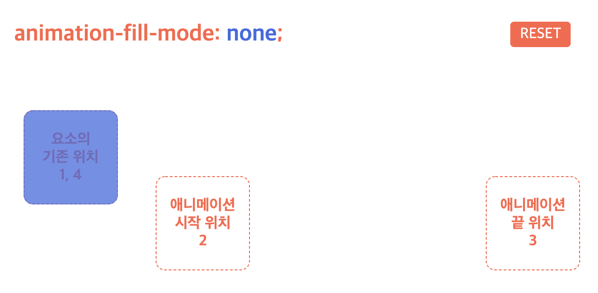
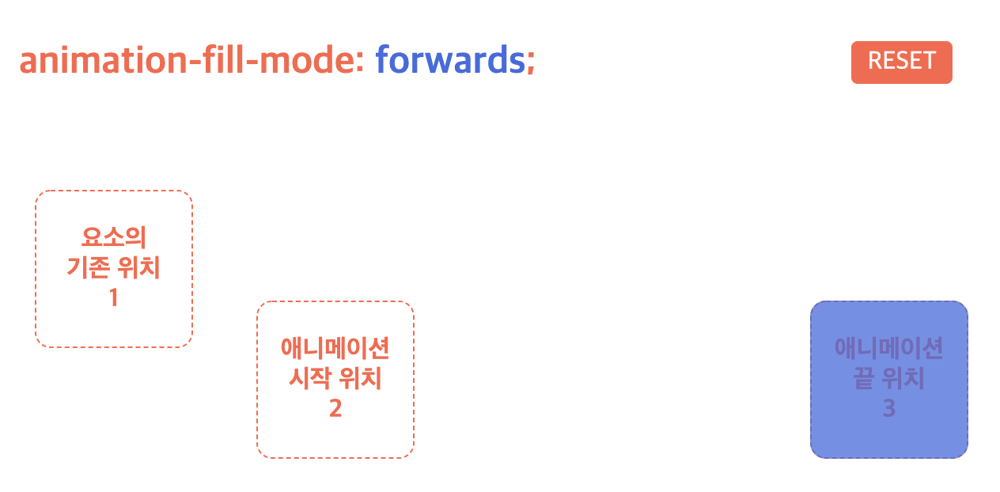
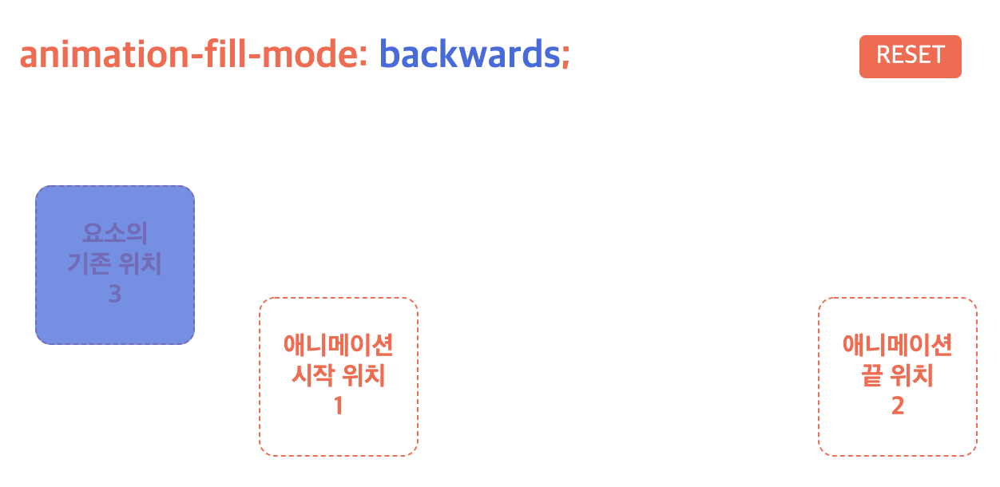
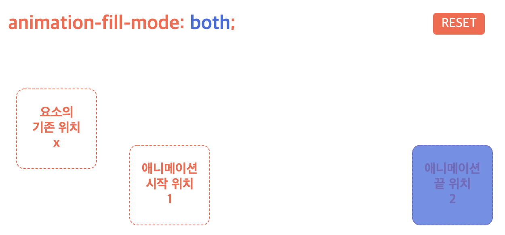
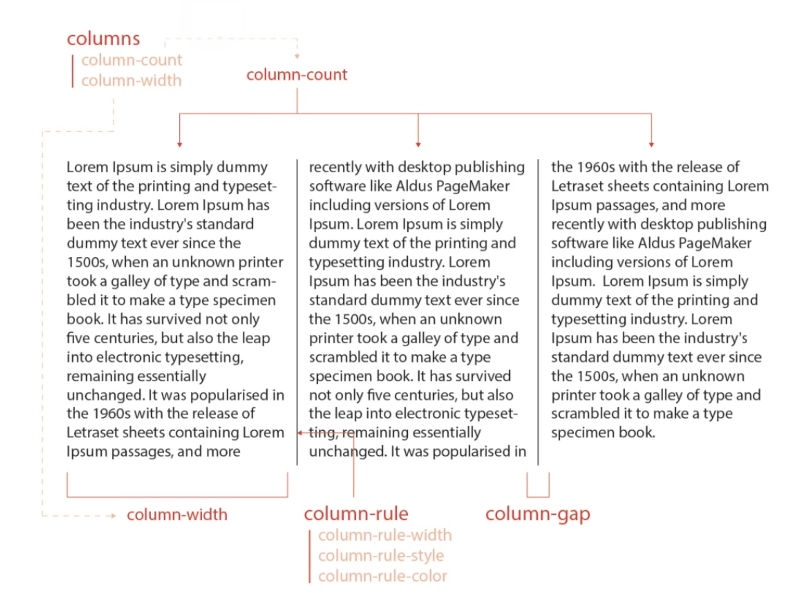

# Animation(애니메이션)

`animation`은 요소에 적용되는 CSS 스타일을 다른 CSS 스타일로 부드럽게 전환시켜 준다. 애니메이션은 애니메이션을 나타내는 CSS 스타일과 애니메이션의 sequence를 나타내는 키프레임(`@keyframes`)들로 이루어진다. `transition` 보다 훨씬 더 규모가 크고 복잡하며 다양한 능력을 가지고 있기 때문에 좀 더 정밀한 효과를 구현할 수 있다.

<br>

## `@keyframes`

`@keyframes` rule 은 시간의 흐름에 따라 적용될 애니메이션 스타일을 설정함으로써 애니메이션의 중간 절차를 제어할 수 있게 한다. 여러 개의 키프레임을 정의하거나 애니메이션 중에 특정 CSS 프로퍼티에 값을 지정하는 지점을 정의할 수 있다. 이는 브라우저가 자동으로 애니메이션을 처리하는 것 보다 더 세밀하게 중간 동작들을 제어할 수 있다는 장점을 가진다.

```css
 @keyframes move {
      /* keyframe */
      0% {
        left: 100px;
      }
      /* keyframe */
      100% {
        top: 300px;
      }
    }
```

<br>

## `animation` 속성

### 1) `animation-name`

요소에 적용시킬 애니메이션을 지정하는 `@keyframes` 규칙의 이름을 설정한다. 하나 이상의 애니메이션 이름을 지정할 수 있다.

|값|의미|default|
|---|---|---|
|none|애니메이션을 지정하지 않음|✔︎|
|@keyframes 이름|이름이 일치하는 @keyframes 적용|

<br>
<br>

### 2) `animation-duration`

한 싸이클의 애니메이션에 소요되는 시간을 초 단위(s) 또는 밀리 초 단위(ms)로 지정한다. 지정되는 값은 0 또는 양수의 숫자이다.

|값|의미|default|
|---|---|---|
|시간|지속 시간을 설정|`0s`|

- `animation-duration`은 반드시 지정해야 한다. 지정하지 않는 경우 기본값 `0s`가 세팅되어 어떠한 애니메이션도 실행되지 않는다.

<br>
<br>

### 3) `animation-timing-function`

애니메이션을 위한 타이밍 함수를 지정한다. [transition-timing-function](https://github.com/bomniekim/TIL/blob/master/css/transitions.md#3-transition-timing-function)과 같은 함수를 사용한다. 

<br>
<br>

### 4) `animation-delay`

애니메이션이 시작할 시점(대기 시간)을 초(s) 또는 밀리 초 (ms)로 지정한다. 설정 값으로 음수가 허용된다. 음수가 있을 경우에는 애니메이션은 바로 시작되지만, 그 값만큼 애니메이션이 앞서 시작된다. 

|값|의미|default|
|---|---|---|
|시간|대기 시간을 설정|`0s`|

> 단축 속성에서 초 단위 값이 `2` 개 인 경우, 앞의 값이 `duration`, 뒤의 값이 `delay`이다.

<br>
<br>

### 5) `animation-iteration-count`

애니메이션의 반복 횟수를 설정한다. 

|값|의미|default|
|---|---|---|
|숫자|반복 횟수를 설정|`1`|
|infinite|무한 반복||


<br>
<br>

### 6) `animation-direction`

애니메이션이 종료된 이후 반복될 때 진행하는 방향을 지정한다.

|값|의미|default|
|---|---|---|
|`normal`|정방향으로 반복|✔︎|
|`reverse`|역방향으로 반복||
|`alternate`|정방향에서 역방향으로 왕복||
|`alternate-reverse`|역방향에서 정방향으로 왕복||

> `alternate` 와 `alternate-reverse` 는 `animation-iteration-count` 를 2 소비한다.

<br>
<br>

### 7) `animation-fill-mode`

애니메이션의 실행 전후 요소의 상태(위치)를 설정한다.

<Br>

- __`none`__ : 기존 위치에서 시작 → 애니메이션 시작 위치로 이동 → 동작 → 기존 위치에서 끝 (default)



<Br>
<Br>

- __`forwards`__: 기존 위치에서 시작 → 애니메이션 시작 위치로 이동 → 동작 → 애니메이션 끝 위치에서 끝



<Br>
<Br>

- __`backwards`__: 애니메이션 시작 위치에서 시작 → 동작 → 기존 위치에서 끝



<Br>
<Br>

- __`both`__: 애니메이션 시작 위치에서 시작 → 동작 → 애니메이션 끝 위치에서 끝



> `both` 는 요소의 기존의 위치로 절대 이동하지 않는다.

<Br>
<Br>

### 8) `animation-play-state`

애니메이션의 재생과 정지를 설정한다. 

|값|의미|default|
|---|---|---|
|running|애니메이션을 동작|✔︎|
|paused|애니메이션 동작을 정지|

<br>
<br>

## `animation` 단축 속성

모든 애니메이션 프로퍼티를 한번에 지정한다. 값을 지정하지 않은 프로퍼티에는 기본값이 지정된다. 지정 방법은 다음과 같다.

```css
animation: name duration timing-function delay iteration-count direction fill-mode play-state
```

<br>
<br>

## Multi-Columns (다단)

한 화면에서 텍스트의 가독성을 확보하기 위해 일반 블록 레이아웃을 확장하여 여러 텍스트 단을 나란히 놓아 화면에 배치한다. 

<br>

### `columns`
다단을 정의하는 단축 속성이다.

- `auto`: 브라우저가 단의 너비와 개수를 설정

- `column-width`
- `column-count`

<br>

#### `column-width`
단의 최적 너비를 설정한다.

|값|의미|default|
|---|---|---|
|`auto`|브라우저가 단의 너비를 설정|✔︎|
|단위|px, em, cm 등의 단위로 지정|

> 각 단이 줄어들 수 있는 최적 너비(최소 너비)를 설정하며, 요소의 너비가 가변하여 하나의 단이 최적 너비보다 줄어들 경우 단의 개수가 조정된다.

<br>
<br>

#### `column-count`
단의 개수를 설정한다.

|값|의미|default|
|---|---|---|
|`auto`|브라우저가 단의 개수를 설정|✔︎|
|숫자|단위 개수를 직접 설정|

<br>
<br>

#### `column-gap`
단과 단 사이의 간격을 설정한다.

|값|의미|default|
|---|---|---|
|`normal`|브라우저가 단과 단 사이의 간격을 설정(1em)|✔︎|
|단위|px, em, cm 등의 단위로 지정|

<br>
<br>

### `column-rule`

단과 단 사이의 (구분)선을 지정하는 단축 속성이다.

|값|의미|default|
|---|---|---|
|`column-width`|선의 두께를 지정|`medium`|
|`column-style`|선의 종류를 지정|`none`|
|`column-color`|선의 색상을 지정|요소의 글자색과 동일|

```css
column-rule: width style color;
```

> (구분)선은 단과 단 사이의 간격 중간에 위치한다. 요소의 글자색(color)을 지정할 경우 column-rule 도 영향을 받는다.

<br>



<br>

<hr>

### References


