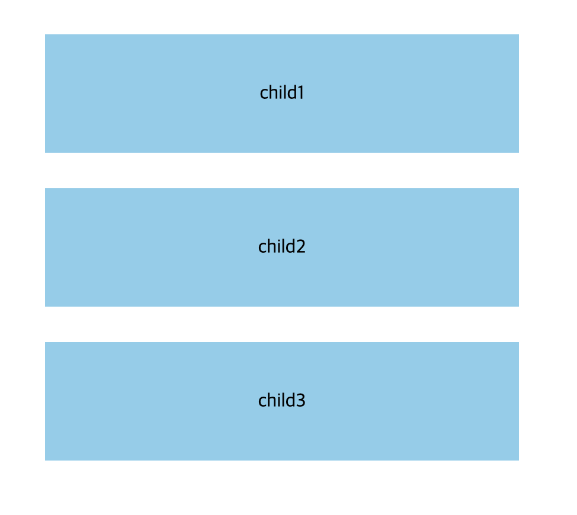
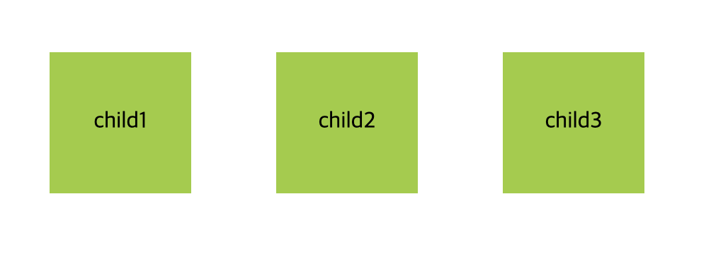
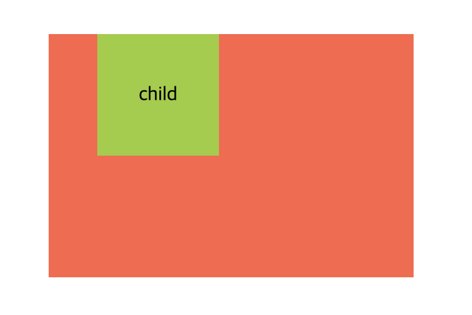
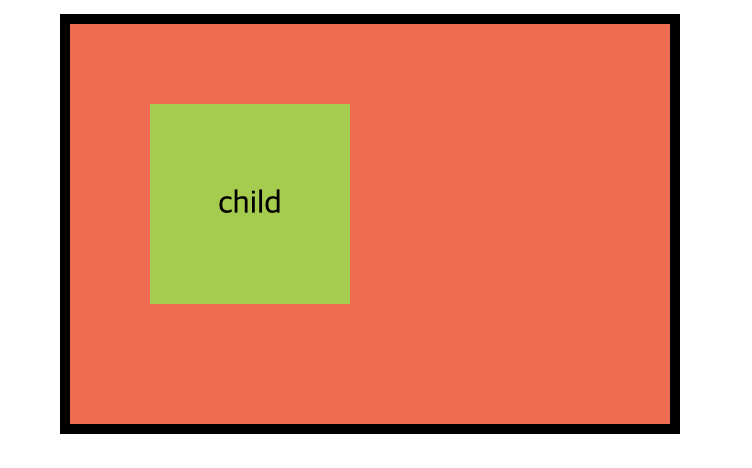
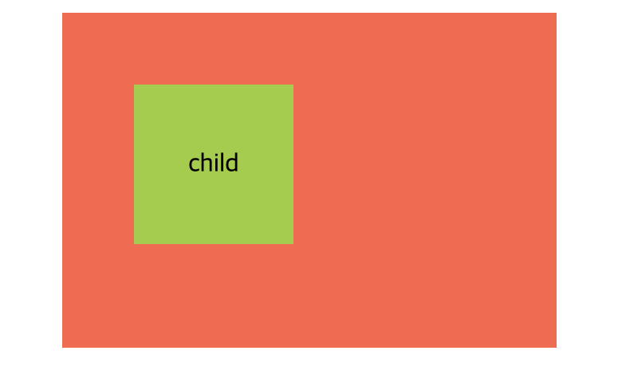
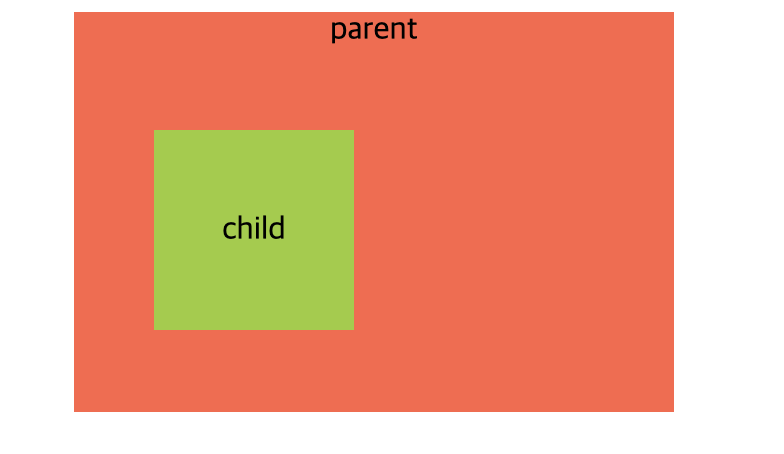

# 박스 모델(Box Model)

모든 HTML 요소는 Box 형태의 영역을 가지고 있다. 이 Box는 콘텐트(Content), 패딩(Padding), 테두리(Border), 마진(Margin)로 구성된다.


브라우저는 박스 모델의 크기(dimension)와 프로퍼티(색, 배경, 모양 등), 위치를 근거로 하여 렌더링을 실행한다.

<br>
<br>

## `content`

요소의 텍스트나 이미지 등의 실제 내용이 위치하는 영역이다. `width`, `height`를 갖는다.

### 1) width
> 요소의 가로 너비

|값|의미|default|
|---|---|---|
|`auto`|브라우저가 너비를 계산|`auto`|
|단위|`px`, `em`, `%` 등||

<br>

### 2) height
> 요소의 세로 높이

|값|의미|default|
|---|---|---|
|`auto`|브라우저가 높이를 계산|`auto`|
|단위|`px`, `em`, `cm` 등||

<br>

### 3) 박스의 최대/최소 너비/높이

- `max-width` / `max-height` : 기본값은 none

- `min-width` / `min-height` : 기본값은 0

<Br>
<Br>

## `margin`

요소의 '__외부(바깥) 여백__'을 지정한다.
> 음수 값(Negative Values)을 사용할 수 있다.

|값|의미|default|
|---|---|---|
|단위|`px`, `em`, `cm` 등|`0`|
|`auto`|브라우저가 너비를 계산||
|`%`|_부모 요소의 __너비___ 에 대한 비율로 지정||

<br>

[사용법]
```css
.box {
    margin: 10px 20px 30px 40px; /* top - right - bottom - left */
    margin: 10px 20px 40px;      /* top - (right/left) - bottom */
    margin: 10px 40px;           /* (top/bottom) - (right/left) */
    margin: 10px;                /* all */
}
```

<br>
<br>

## 마진 중복(병합,상쇄 Margin Collapse)

마진의 특정 값들이 '중복'되어 합쳐지는 현상이다. 이는 버그(오류)가 아니며 우회하거나 응용할 수 있다. 다음은 마진 중복이 발생하는 경우이다.

<br>

### 1) 형제 요소들의 `margin-top` 과 `margin-bottom` 이 만났을 때



> margin: 30px을 설정한 `div` <br> `margin-top` 과 `margin-bottom`이 만나는 부분의 마진 상쇄가 발생했다.



> 형제 요소의 `margin-left`와 `margin-right`가 중첩되는 경우는 마진이 상쇄되지 않고 보존된다.

<br>


### 2) 부모 요소의 `margin-top` 과 자식 요소의`margin-top` 이 만났을 때



> child의 margin: 40px로 설정<br> 부모의 `margin-top`을 지정하지 않았지만 child의 margin-top: 40px의 영향을 받았다. 

<br>

### 3) 부모 요소의 `margin-bottom` 과 자식 요소의`margin-bottom` 이 만났을 때
> 위와 같은 경우이다.


<br>
<br>

그러나 부모/자식 요소의 마진 중복은 다음의 경우에만 발생한다.

#### 1&rpar; 부모 요소의 `border`가 없거나
> 부모 요소에 `border`가 설정되면 아래와 같이 마진 상쇄가 사라진다.


#### 2&rpar; 부모 요소의 `padding`이 없거나
> 부모 요소에 `padding`을 설정하면 마진 상쇄가 일어나지 않는다.



#### 3&rpar; 부모 요소에 인라인 요소가 없는 경우 
> 부모 요소에 `text(인라인 요소)`가 있다면 마진 상쇄가 일어나지 않는다.


<br>

### 마진 중복 계산하기

마진 중복 현상이 발생하는 경우, 중복 값은 다음과 같이 계산한다.

|조건|요소A margin|요소B margin|계산법|중복값|
|---|---|---|---|---|
|둘 다 양수|`30px`|`10px`|더 큰 값으로 중복|`30px`|
|둘 다 음수|`-30px`|`-10px`|더 큰 값으로 중복|`30px`|
|양수와 음수|`-30px`|`10px`|`-30`+`10`=`-20`|`-20px`|

<br>
<br>

## `padding`

요소의 '__내부(안쪽) 여백__'을 지정한다.

|값|의미|default|
|---|---|---|
|단위|`px`, `em`, `cm` 등|`0`|
|`%`|_부모 요소의 __너비___ 에 대한 비율로 지정||

<br>
<br>

## padding 으로 인한 요소의 크기 증가

요소에 padding 이 지정되면 추가된 `padding` 값만큼 요소의 전체 크기가 커진다.<br>요소의 크기가 `padding` 크기를 흡수해 커지는 이유는 `box-sizing` 의 기본 값이 `content-box`이기 때문이다. <br>즉, 요소의 `width` 값을 `150px` 로 지정하면 박스 모델의 _content-box 의 영역만_ 온전히 `150px`로 지정한다는 의미이다.

<br>

### padding 의 영향으로 인한 요소의 크기 증가 막기

#### 1) 직접 계산

`div`의 `width` / `height` 값이 각각 100px인 요소의 내부에 10px의 `padding` 을 추가하면서 요소의 크기를 그대로 100px 로 유지하려면 <br>다음과 같이 직접 계산하여 값을 지정할 수 있다.
```css
div {
    width: 80px;
    height: 80px;
    background: skyblue;
    padding: 10px;
}
```

<br>

#### 2) 자동 설정 `box-sizing` : `border-box` 

위와 같은 상황에서 `width` / `height` 값을 직접 계산하지 않고
다음과 같이 `box-sizing`:`border-box`; 속성을 추가하여 요소의 크기 증가를 막을 수 있다.
```css
div {
    width: 100px;
    height: 100px;
    padding: 10px;
    background: skyblue;
    box-sizing: border-box;
}
```
> 이 경우 `content-box` 의 크기가 `80px * 80px` 로 줄어든다.

<br>
<br>

## `box-sizing`

박스 모델에서 지정한 너비와 높이는 요소의 `content-box` 크기에만 적용된다. 요소에 `border`나 `padding`이 있으면 content-box의 너비와 높이에 더해서 화면에 그린다. 따라서 요소의 크기를 설정할 때, 원하는 값을 얻으려면 이를 고려해야 한다.

box-sizing 은 다음 속성을 사용하여 조절할 수 있다.
- content-box (default)
- border-box

아래의 사진은 박스 모델의 구성 요소이다. HTML 문서가 렌더링된 후 박스의 width / height (content), padding, margin, border에 적용된 값을 나타낸 것이며 이는 크롬 개발자 도구에서 확인할 수 있다.


> padding-box는 브라우저의 호환성 문제로 사실상 사용되지 않는다.


---
### References
- https://zellwk.com/blog/understanding-css-box-sizing/


