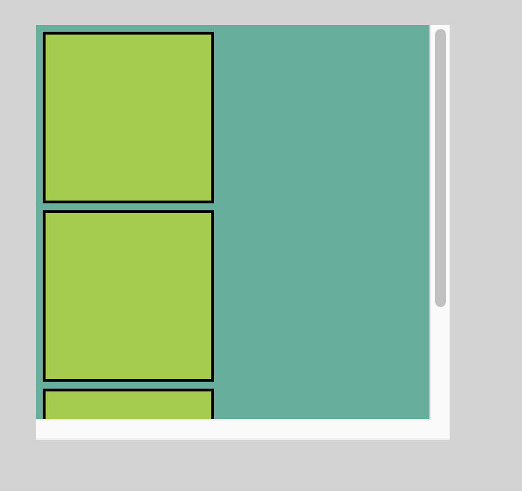
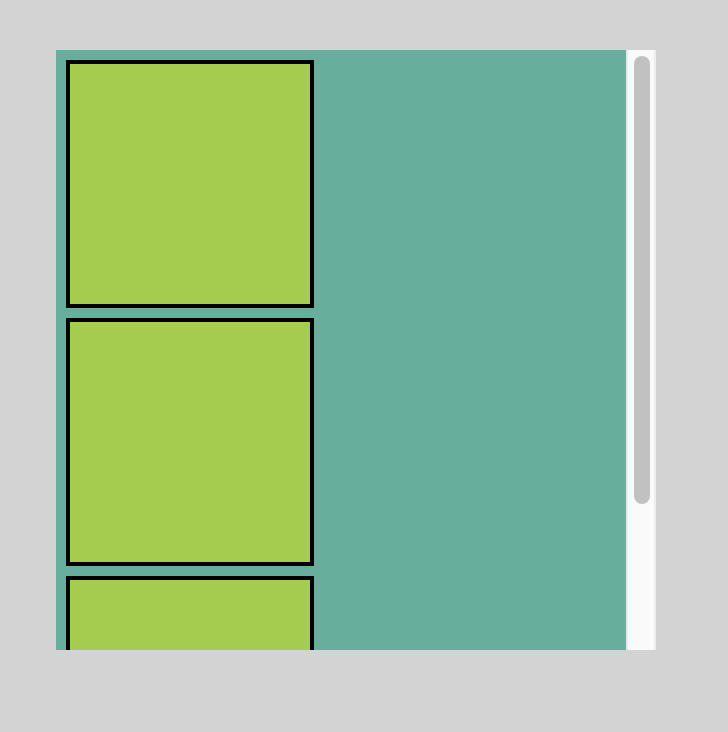
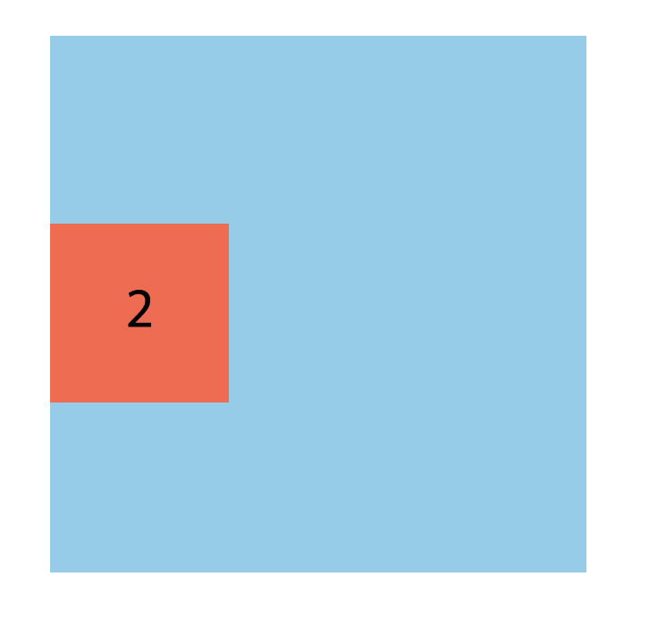
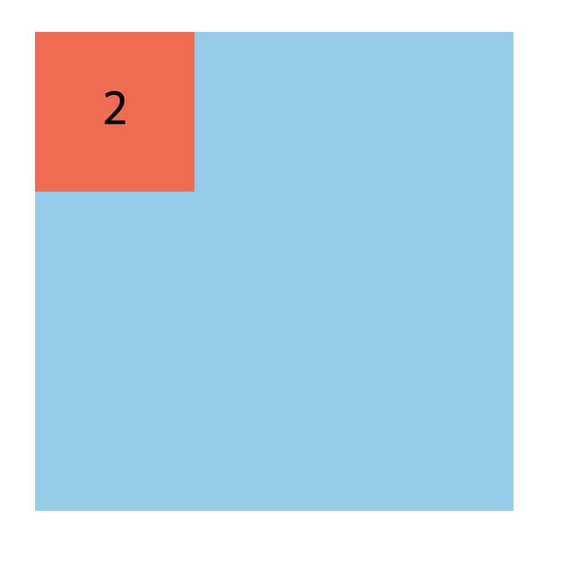

# CSS Display

<Br>
<Br>

## `display`

`display` 는 요소의 layout 정의에 사용되는 중요한 프로퍼티이다.

```css
 display: value;
```

- `block`

- `inline`
- `inline-block`
- `none`

<br>
<br>

### 1) `block`
```css
.block {
    width: auto; /* 100% */
    height: auto; /* 0 */
}
```

- 항상 새로운 라인에서 시작한다.

- 화면 크기 전체의 가로폭을 차지한다. (width: 100%)

- `width`, `height`, `margin`, `padding` 프로퍼티 지정이 가능하다.

- block 레벨 요소 내에는 inline 레벨 요소를 포함할 수 있다.

- [block elements list 모두 보기](https://developer.mozilla.org/en-US/docs/Web/HTML/Block-level_elements#Elements)


<Br>
<Br>

### 2) `inline`
```css
.inline {
    width: auto; /* 0 */
    height: auto; /* 0 */
}
```

- 새로운 라인에서 시작하지 않으며 라인의 중간에 들어갈 수 있다. 즉, 줄을 바꾸지 않고 다른 요소와 함께 한 행에 위치한다.

- content의 너비만큼 가로폭을 차지한다.

- __width, height, margin-top, margin-bottom 프로퍼티를 지정할 수 없다. 상, 하 여백은 line-height로 지정한다.__

- inline 레벨 요소 내에 block 레벨 요소를 포함할 수 없다.

- [inline elements list 모두 보기](https://developer.mozilla.org/en-US/docs/Web/HTML/Inline_elements#Elements)

<br>
<br>

### 3) `inline-block`

- block과 inline 레벨 요소의 특징을 모두 갖는다. 

- `inline` 레벨 요소와 흡사하게 줄을 바꾸지 않고 다른 요소와 함께 한 행에 위치시킬 수 있다.

- `block` 레벨 요소처럼 `width`, `height`, `margin`, `padding`를 모두 정의할 수 있다. 

- content의 너비만큼 가로 폭을 차지한다.

<br>
<br>

### 4) none
해당 요소를 화면에 표시하지 않는다. (DOM tree에서 아예 사라진다.)

<br>
<br>

## `overflow`
요소의 크기 이상으로 내용(자식요소)이 넘쳤을 때, 내용이 보여지는 것을 제어한다. 

|값|의미|default|
|---|---|---|
|`visible`|넘친 부분을 자르지 않고 그대로 보여줌|`visible`|
|`hidden`|넘친 부분은 숨기고 보이지 않도록 함||
|`scroll`|넘친 부분을 잘라내고 scroll bar를 이용하여 볼 수 있도록 함(가로/세로 모두 scroll bar가 생김)||
|`auto`|넘친 부분이 있는 경우만 잘라내고, 넘친 부분만 scroll을 이용하여 볼 수 있도록 함(넘친 부분이 있는 쪽만 scroll bar가 생김)|

<br>

#### overflow: scroll


#### overflow: auto


<br>
<br>

## `opacity`

`opacity`는 요소의 투명도를 정의한다. 0.0 ~ 1.0의 값을 입력하며 0.0은 투명, 1.0은 불투명을 의미한다.


<br>

### opacity: 0과 display: none의 차이

#### opacity: 0


> 투명도를 0으로 설정하면 요소를 그 자리에서 숨겨준다. (visibility: hidden과 같음.)

<br>

#### display: none


> `display: none`은 요소를 그 자리에서 사라지게 한다. 

<br>
<br>

---
### References
- [MDN CSS display](https://developer.mozilla.org/ko/docs/Web/CSS/display)
- [CSS display](https://poiemaweb.com/css3-display)
