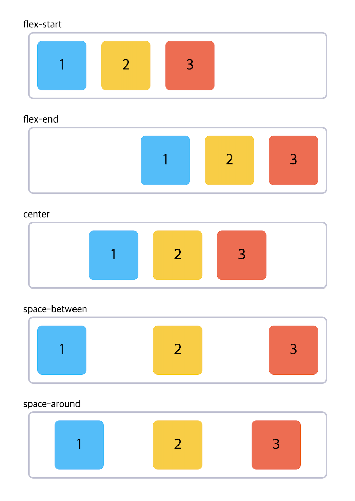
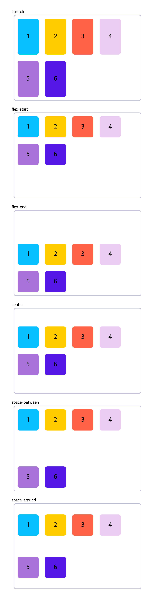
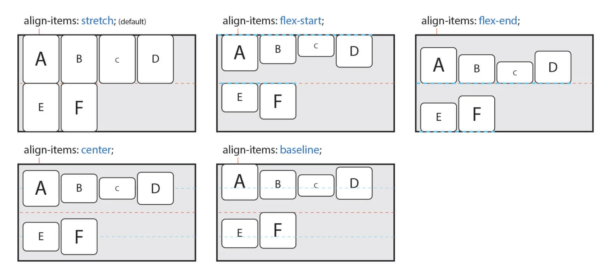

## Flex Container 속성
<Br>

### 1) `display`

flex container(부모 요소)의 layout 배치를 정하는 속성이다.

|값|의미|
|---|---|
|`flex`| block 특성의 Flex Container를 정의(수직 쌓임)|
|`inline-flex`| inline 특성의 Flex Container를 정의(수평 쌓임)|

<br>

> `flex` 또는 `inline-flex`는 부모 요소에 반드시 지정해야 자식 요소가 flex item이 되어 flexbox를 사용할 수 있다.

<br>
<br>

### 2) `flex-direction`

flex container의 __주축(main axis)__ 방향을 설정한다.

|값|의미|default|
|---|---|---|
|`row`|items를 왼쪽에서 오른쪽(수평축)으로 표시|✔︎|
|`row-reverse`|items를 오른쪽에서 왼쪽(반대 수평축)으로 표시||
|`column`|items를 위에서 아래(수직축)로 표시||
|`column-reverse`|items를 아래에서 위(반대 수직축)로 표시||

<br>


<br>
<br>


### 3) `flex-wrap`

기본적으로 items는 _한 줄에서만 표시되고 줄 바꿈 되지 않는다._<br>
`flex-wrap`은 items를 강제로 한 줄에 배치되게 할 것인지, 혹은 가능한 영역 내에서 벗어나지 않고 여러 행으로 나누어 배치할 것인지 결정하는 속성이다.<br>
배치의 시작점은 `flex-direction` 에 의해 결정된 방향으로 적용된다.

|값|의미|default|
|---|---|---|
|`nowrap`|모든 items를 한 줄에 표시|✔︎|
|`wrap`|items를 여러 줄로 묶음||
|`wrap-reverse`|items를 wrap의 역 방향으로 여러 줄로 묶음|


> <code>flex-direction: row</code> 인 경우


<br>
<br>

### `flex-flow`

`flex-flow`는 `flex-direction` 속성과 `flex-wrap` 속성을 설정하기 위한 단축 속성이다. 기본값은 `row nowrap`이다.

```css
.flex-container {
  flex-flow: flex-direction flex-wrap;
}
```

<br>
<br>

### 4) `justify-content`

flex container의 주 축(main axis)을 기준으로 items의 정렬 방법을 설정한다. `flex-direciton: row;`를 default로 한다.

|값|의미|default|
|---|---|---|
|`flex-start`|items를 시작점(flex-start)을 기준으로 정렬|✔︎|
|`flex-end`|items를 끝점(flex-end)을 기준으로 정렬|
|`center`|items를 가운데로 정렬|
|`space-between`|첫번째 item과 마지막 item을 각각 시작점, 끝점에 붙이고 나머지 items의 사이 간격을 균등하게 분배해서 정렬|
|`space-around`|items를 균등한 여백을 포함하여 정렬|



<br>
<br>

### 5) `align-content`

flex container의 교차 축(cross-axis) 기준으로 items의 정렬 방법을 설정한다.
> `flex-wrap` 을 통해 items가 여러 줄(2줄 이상)이고 여백이 있을 경우만 사용할 수 있다.<br>
items가 한 줄일 경우 `align-items` 속성을 사용해야 한다.

|값|의미|default|
|---|---|---|
|`stretch`|container의 교차 축을 채우기 위해 items를 교차 축 방향으로 늘림|✔︎|
|`flex-start`|`justify-content`의 속성과 같음|
|`flex-end`|〃|
|`center`|〃|
|`space-between`|〃|
|`space-around`|〃|



> `stretch`는 교차 축에 해당하는 너비의 값이 `auto` 인 경우 교차 축을 채우기 위해 자동으로 늘어난다.

<br>
<br>

### 6) `align-items`

`align-content`와 마찬가지로 교차 축(cross-axis) 기준으로 items의 정렬 방법을 설정한다. 단, items가 한 줄일 경우 많이 사용한다.

> 주의할 점은 items가 flex-wrap을 통해 여러 줄(2줄 이상)일 경우에는 `align-content` 속성이 우선한다.
따라서 `align-items`를 사용하려면 `align-content` 속성을 기본값(`stretch`)으로 설정해야 한다.

|값|의미|default|
|---|---|---|
|`stretch`|`align-content`의 속성과 같음|✔︎|
|`flex-start`|〃|
|`flex-end`|〃|
|`center`|〃|
|`baseline`|items를 문자 기준선에 맞추어 정렬|



<br>
<br>


