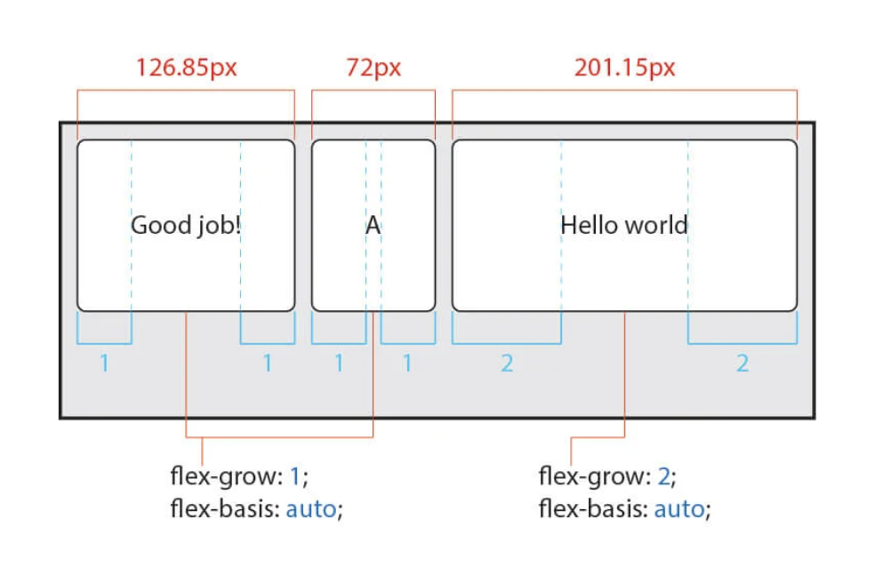

## Flex Items 속성
<Br>

### 1) `order`

flex items의 배치 순서를 설정한다.<br> HTML 코드를 변경하지 않고 `order` 속성 값을 지정하는 것으로 간단히 재배치할 수 있다는 장점을 가진다.<br>
기본 배치 순서는 `flex container`에 추가된 순서이다.

|값|의미|default|
|---|---|---|
|숫자|items의 배치 순서를 지정|`0`|
> 음수 허용


<Br>
<Br>

### 2) `flex-grow`

item의 증가하는 너비의 비율을 설정한다.
숫자가 클수록 더 많은 너비를 가진다.<Br>
item이 가변 너비가 아니거나, 값이 0일 경우 효과가 없다. (요소의 너비가 고정 값으로 지정되어 있다면 그 너비를 유지한다.)

> 따라서, 화면의 크기 조정에 따라 요소의 사이즈가 변하는 반응형을 만들 때, 가변하는 부분에 대해서는 `flex-grow`로 설정하고 고정 부분에 대해서는 width로 고정 값을 주면 된다. 

|값|의미|default|
|---|---|---|
|숫자|item의 증가 너비 비율을 설정|`0`|
> 음수 값은 무효.


> 위의 그림은 3 개의 item 모두 기본 `width:200px` 로 지정되어 있고, 아래 그림은 빨간 item만 고정 너비 200px이 지정되어 있는 모습이다. `flex-grow`를 지정한 숫자에 맞게 요소의 너비를 지정하기 위해서는 아래의 방법을 사용하는 것이 좋다.


<br>
<br>

### 3) `flex-shrink`

item이 감소하는 너비의 비율을 설정한다.
숫자가 클수록 더 많은 너비가 감소한다.<br>
item이 가변 너비가 아니면 효과가 없으며 0을 지정하면 축소가 해제되어 원래의 너비를 유지한다.

|값|의미|default|
|---|---|---|
|숫자|item의 감소 너비 비율을 설정|`1`|
> 음수 값은 무효


<br>
<br>

### 4) `flex-basis`

item의 (공간 배분 전) 기본 너비를 설정한다.<br>
값이 `auto`일 경우 `width, height` 등의 속성으로 item의 너비를 설정할 수 있다.<br>
하지만 `flex-basis`의 단위 값이 주어질 경우 고정 값으로 너비를 설정할 수 없다.

|값|의미|default|
|---|---|---|
|`auto`|가변 item과 같은 너비|✔|
|단위|px, em, cm 등 단위로 지정|



> flex-basis가 `auto`인 경우 item의 contents의 너비가 item의 너비에 영향을 준다. 각 아이템의 contents를 제외한 나머지 여백을 가지고 비율에 맞게 너비를 설정한다.


> flex-basis가 `0`인 경우, 순수하게 다른 설정 값들의 영향을 받는다.


> flex-basis를 단위 값으로 지정하면, item의 기본 너비로 지정된다. 

<br>
<br>

### `flex`

위의 2) ~ 4) 의 단축 속성으로써 item의 너비(증가, 감소, 기본)를 설정한다.

```css
    flex: 증가너비 감소너비 기본너비;
```
```css
.item {
  flex: 1 1 20px;  /* grow shrink basis */
  flex: 1 1;  /* grow shrink */
  flex: 1 20px;  /* grow basis (단위를 사용하면 `flex-basis`가 적용된다) */
}
```

`flex-grow`를 제외한 개별 속성은 생략할 수 있다. <br>
이 때 flex-basis의 값을 생략할 경우 단축 속성인 `flex`에서의 값은 0이 적용된다.
즉 `flex`의 default 값은 __`flex: 0 1 0;`__ 이다.

<br>
<br>

### 5) `align-self`

교차 축(cross-axis)에서 개별 item의 정렬 방법을 설정한다.

`align-items`는 container 내 모든 items의 정렬 방법을 설정하는 반면,
필요에 의해 일부 item만 정렬 방법을 변경하려고 할 경우 `align-self`를 사용한다.

이 속성은 align-items 속성보다 __우선한다__.

|값|의미|default|
|---|---|---|
|auto|container의 `align-items` 속성을 상속받음|✔︎|
|stretch|container의 교차 축을 채우기 위해 item을 늘림|	
|flex-start|item을 각 줄의 시작점(flex-start)으로 정렬|	
|flex-end|item을 각 줄의 끝점(flex-end)으로 정렬|
|center|item을 가운데로 정렬	
|baseline|item을 문자 기준선에 맞추어 정렬|


