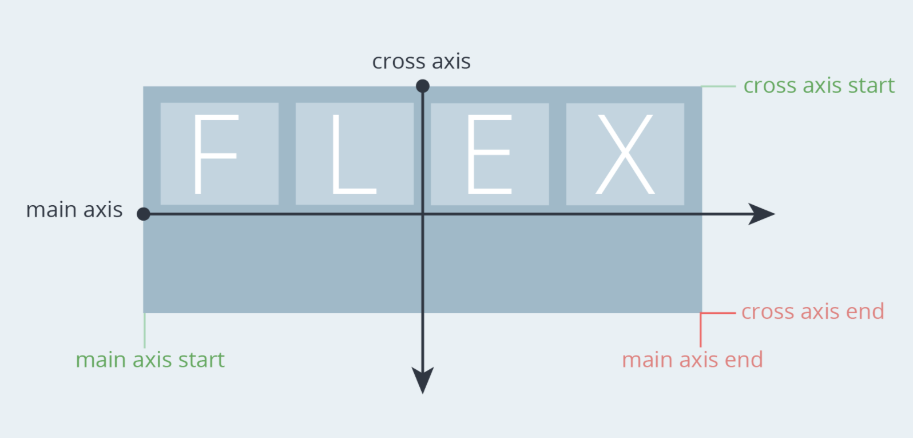
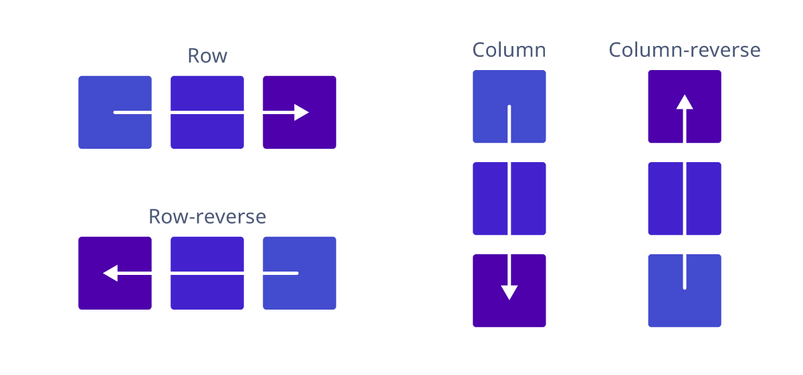
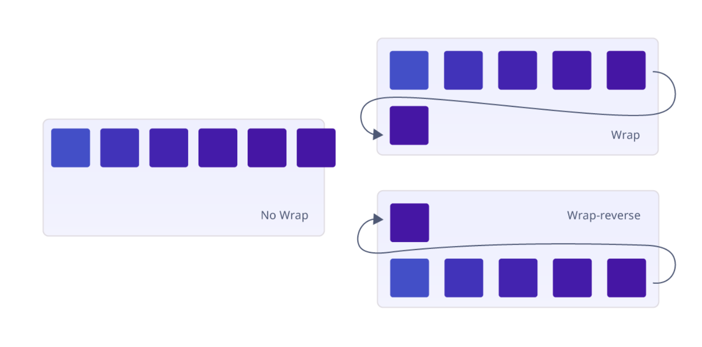
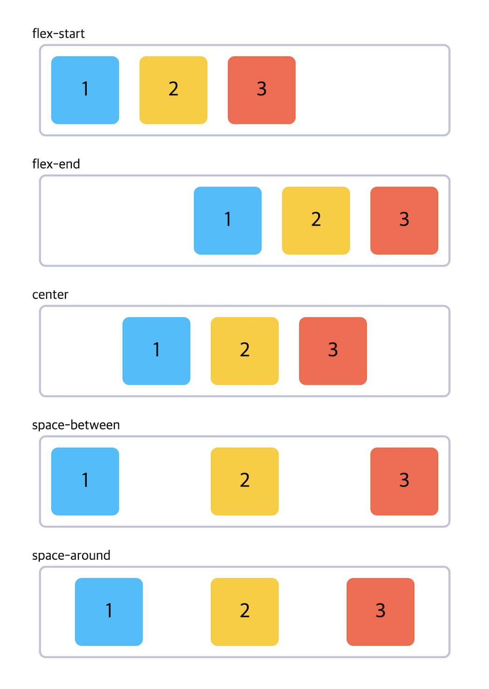
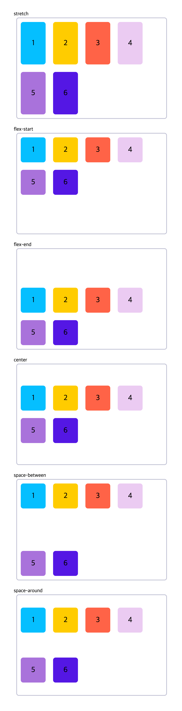
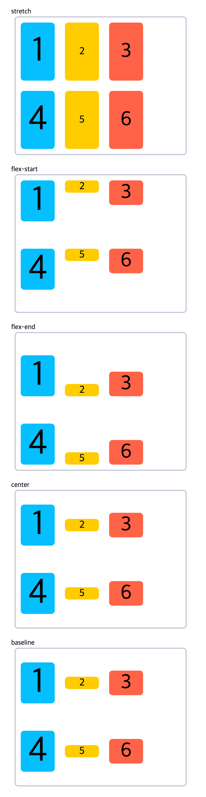

# Flexbox (CSS3 Flexible Box)

`Flexbox`는 모던 웹을 위하여 제안된 기존 layout보다 더 세련된 방식의 니즈에 부합하기 위한 CSS3의 새로운 layout 방식이다.

과거에는 화면 상의 요소를 수평 구조로 만드는 속성이 명확하지 않았기 때문에, `<table>`나 `float` 혹은 `inline-block` 등을 사용하여 구현하였다.<br>하지만 이러한 방법들은 다양한 문제를 가지고 있었고 구성의 차선책에 불과하였다.

이를 개선하기 위해 요소의 사이즈가 불명확하거나 동적으로 변화할 때에도 유연한 레이아웃을 실현할 수 있는 `Flexbox`가 고안되었다. <Br>이는 복잡한 레이아웃이라도 적은 코드로 보다 간단하게 표현할 수 있는 장점이 있다.

<br>

## Flex Container & Flex Items


`Flexbox`는 __flex items__ 이라 불리는 복수의 자식 요소와 이들을 정렬하기 위해 감싸는 __flex container__ 부모 요소로 구성된다.


<br>
<br>


> ### 주 축(main-axis)과 교차 축(cross-axis) 
> flexbox 에서 축(axis)의 개념은 container의 자식 요소인 items의 배치 흐름의 방향에 대한 것이다.<br>
주 축은 배치 흐름과 같은 방향의 축을 말하고, 교차 축은 주 축을 가로 지르는 축을 말한다.<Br>
값 `row`는 items를 __수평__ 축으로 배치하므로 이때는 주 축이 수평이며 교차 축은 수직이 된다.<br>
반대로 값 `column`은 items를 __수직__ 축으로 배치하므로 주 축은 수직이, 교차 축은 수평이 된다.<br>
_즉, 방향(수평, 수직)에 따라 주 축과 교차 축이 달라진다._

<br>

> ### 시작점(flex-start)과 끝점(flex-end)
> 시작점(`flex-start`)과 끝점(`flex-end`)이라는 개념도 있다.<br>
이는 주 축이나 교차 축의 시작하는 지점(axis start)과 끝나는 지점(axis end)을 지칭하는 것으로써 이 역시 방향에 따라 시작점과 끝점이 달라진다.




<br>
<br>


### Flex Container 속성

### 1) `display`

flex container(부모 요소)의 layout 배치를 정하는 속성이다.

|값|의미|
|---|---|
|`flex`| block 특성의 Flex Container를 정의(수직 쌓임)|
|`inline-flex`| inline 특성의 Flex Container를 정의(수평 쌓임)|

<br>

> `flex` 또는 `inline-flex`는 부모 요소에 반드시 지정해야 자식 요소가 flex item이 되어 flexbox를 사용할 수 있다.

<br>
<br>

### 2) `flex-direction`

flex container의 __주축(main axis)__ 방향을 설정한다.

|값|의미|default|
|---|---|---|
|`row`|items를 왼쪽에서 오른쪽(수평축)으로 표시|✔︎|
|`row-reverse`|items를 오른쪽에서 왼쪽(반대 수평축)으로 표시||
|`column`|items를 위에서 아래(수직축)로 표시||
|`column-reverse`|items를 아래에서 위(반대 수직축)로 표시||

<br>



<br>
<br>


### 3) `flex-wrap`

기본적으로 items는 _한 줄에서만 표시되고 줄 바꿈 되지 않는다._<br>
`flex-wrap`은 items를 강제로 한 줄에 배치되게 할 것인지, 혹은 가능한 영역 내에서 벗어나지 않고 여러 행으로 나누어 배치할 것인지 결정하는 속성이다.<br>
배치의 시작점은 `flex-direction` 에 의해 결정된 방향으로 적용된다.

|값|의미|default|
|---|---|---|
|`nowrap`|모든 items를 한 줄에 표시|✔︎|
|`wrap`|items를 여러 줄로 묶음||
|`wrap-reverse`|items를 wrap의 역 방향으로 여러 줄로 묶음|



> <code>flex-direction: row</code> 인 경우


<br>
<br>

### `flex-flow`

`flex-flow`는 `flex-direction` 속성과 `flex-wrap` 속성을 설정하기 위한 단축 속성이다. 기본값은 `row nowrap`이다.

```css
.flex-container {
  flex-flow: flex-direction flex-wrap;
}
```

<br>
<br>

### 4) `justify-content`

flex container의 주 축(main axis)을 기준으로 items의 정렬 방법을 설정한다. `flex-direciton: row;`를 default로 한다.

|값|의미|default|
|---|---|---|
|`flex-start`|items를 시작점(flex-start)을 기준으로 정렬|✔︎|
|`flex-end`|items를 끝점(flex-end)을 기준으로 정렬|
|`center`|items를 가운데로 정렬|
|`space-between`|첫번째 item과 마지막 item을 각각 시작점, 끝점에 붙이고 나머지 items의 사이 간격을 균등하게 분배해서 정렬|
|`space-around`|items를 균등한 여백을 포함하여 정렬|



<br>
<br>

### 5) `align-content`

flex container의 교차 축(cross-axis) 기준으로 items의 정렬 방법을 설정한다.
> `flex-wrap` 을 통해 items가 여러 줄(2줄 이상)이고 여백이 있을 경우만 사용할 수 있다.<br>
items가 한 줄일 경우 `align-items` 속성을 사용해야 한다.

|값|의미|default|
|---|---|---|
|`stretch`|container의 교차 축을 채우기 위해 items를 교차 축 방향으로 늘림|✔︎|
|`flex-start`|`justify-content`의 속성과 같음|
|`flex-end`|〃|
|`center`|〃|
|`space-between`|〃|
|`space-around`|〃|



> `stretch`는 교차 축에 해당하는 너비의 값이 `auto` 인 경우 교차 축을 채우기 위해 자동으로 늘어난다.

<br>
<br>

### 6) `align-items`

`align-content`와 마찬가지로 교차 축(cross-axis) 기준으로 items의 정렬 방법을 설정한다. 단, items가 한 줄일 경우 많이 사용한다.

> 주의할 점은 items가 flex-wrap을 통해 여러 줄(2줄 이상)일 경우에는 `align-content` 속성이 우선한다.
따라서 `align-items`를 사용하려면 `align-content` 속성을 기본값(`stretch`)으로 설정해야 한다.

|값|의미|default|
|---|---|---|
|`stretch`|`align-content`의 속성과 같음|✔︎|
|`flex-start`|〃|
|`flex-end`|〃|
|`center`|〃|
|`baseline`|items를 문자 기준선에 맞추어 정렬|



<br>
<br>


<hr>


### References
- [Understanding the CSS3 Flexbox](http://blogs.quovantis.com/understanding-the-css3-flexbox/)
- [모던 레이아웃 - 플렉스박스(Flexbox)](https://webclub.tistory.com/628)


