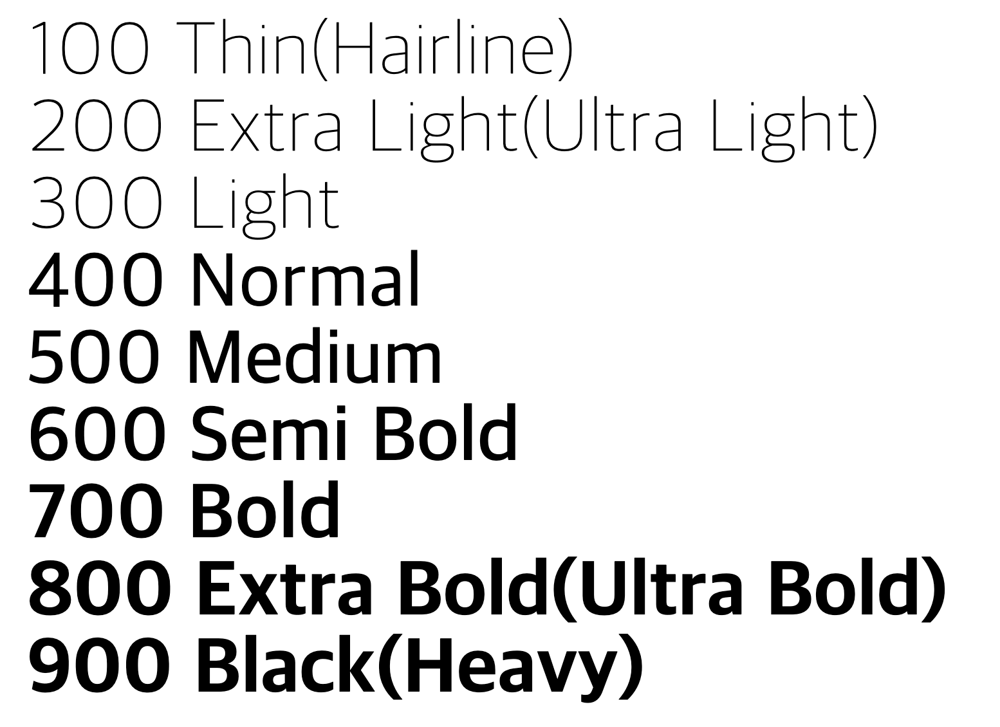
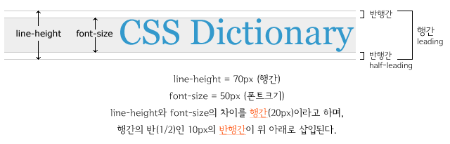
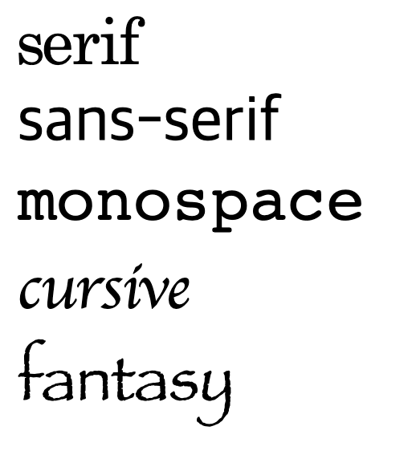

# 폰트(font)와 텍스트(text)


## 폰트 속성(font properties)
<br>

### 1) `font-style`
글자의 스타일(기울기)를 지정한다.

|값|의미|default|
|---|---|---|
|`normal`|스타일 없음|✔︎|
|`italic`|이탤릭체(기울어짐)||
|`oblique`|기울어진 글자||
|`oblique deg`|기울어진 글자(각도 설정)||

<br>


### 2) `font-weight`
글자의 두께(가중치)를 지정한다.

|값|의미|default|
|---|---|---|
|`normal`|`400`과 동일|✔︎|
|`bold`|`700`과 동일/ 두껍게||
|bolder|부모 요소보다 더 두껍게(상대적)||
|lighter|부모 요소보다 더 얇게(상대적)||
|`100`~`900`|사이의 숫자로 지정|



<br>
<br>

#### 숫자 값과 두께의 불일치

글꼴의 정확한 두께를 숫자로 표현할 수 없는 경우에는 각 브라우저마다 가지고 있는 글꼴 리소스 중 가장 비슷한 두께를 가진 폰트를 가져와 적용한다.

> 예를 들어, `normal`과 `bold`만 지원하는 글꼴일 경우, `100`~`500`은 `normal`을 의미하고 `600`~`900`은 `bold`를 의미한다.

<br>
<br>

### 3) `font-size`

글꼴 크기를 지정한다. 하위 요소로 상속되는 특성을 가진다. 특정 단위나 `%`를 사용해 설정한 값 이외의 것(`small`, `medium`, `large` 등)은 불분명한 값이므로 사용하는 것을 지양한다.

<br>
<br>

### 4) `line-height`

텍스트의 높이를 지정한다. 텍스트 수직 정렬에도 응용되어 사용된다.

|값|의미|default|
|---|---|---|
|`normal`|브라우저의 기본 정의를 사용(`1`~`1.4`)|✔︎|
|단위|`px`, `em`, `cm` 등||
|숫자|요소 자체 글꼴 크기의 배수로 지정||
|`%`|요소 자체 글꼴의 비율로 지정||

> 일반적으로 단위와 배수를 가장 많이 사용하며 `1.4`~`1.7`배가 가장 적합하다. <br>특정 단위로 설정했을 때 다른 요소의 값이 변경된다면 유동적으로 변경하는 것이 힘들다.




<br>
<br>

### 5) `font-family`

글꼴 이름을 지정한다. 여러 개의 글꼴을 작성하여 글꼴 후보 목록을 지정한다. 

지정한 후보 글꼴들 중 아무 것도 갖고있지 않은 환경(브라우저/운영체제)에서는 다른 글꼴이 자동으로 적용된다. 이때 최소한 같은 계열에 속하는 글꼴이 사용될 수 있도록 글꼴 계열을 함께 지정해준다다. 따라서 __글꼴 계열은 필수로 명시해주어야 한다.__

```css
 font-family: [글꼴후보1, 글꼴후보2...], 글꼴계열;
```
```css
.app {
	font-family: Arial, "Open Sans", "돋움", dotum, sans-serif;
}
```
<Br>

> 사용자가 웹사이트에 접속하면 웹 브라우저는 필요한 리소스들을 다운로드 받아 이를 기반으로 사이트를 렌더링한다. 하지만 `font-family`에 명시한 폰트들은 다운로드하여 사용하지 않는다. 대신 사용자의 컴퓨터 운영체제가 제공하는 폰트 중 일치하는 폰트를 사용하고, 없다면 같은 계열의 폰트를 사용한다. 이는 성능(속도)상 이유 때문이다.

<Br>

#### [글꼴계열]
|계열|의미|
|---|---|
|`serif`|바탕체 계열|
|`sans-serif`|고딕체 계열|
|`monospace`|고정폭(너비)이 동등한 글꼴 계열|
|`cursive`|필기체 계열|
|`fantasy`|장식이 있는 글꼴 계열|




### font 단축 속성

font 속성을 한 번에 단축하여 지정할 수 있다. 다른 값은 생략 가능하지만 `font-size`, `font-family` 값은 필수로 지정해야 한다.<br> `line-height` 값은 \/를 사용하여 `font-size` 값과 명확하게 구분해야 한다.

```css
  font: (font-style) (font-weight) font-size / (line-height) font-family;
```
```css
.app {
	font: italic bold 20px / 1.5 "Arial", sans-serif;
}
```
<br>
<br>

### 6) `color`

글꼴의 색상을 지정한다.

<br>

[색상표현 방법]
|표현|의미|예시|
|---|---|---|
|색상이름|브라우저에서 제공하는 색상이름|`red`, `blue` 등||
|`Hex Code`| 16진수 색상(Hexadecimal colors) 0-9,a-f 사용| #000000(Black) - #ffffff(White)|
|`rgb()`| Red, Green, Blue 값 지정| rgb(255, 255, 255)|
|`rgba()`| Red, Green, Blue, Opacity 값 지정| rgba(255, 255, 255, .5)|
|`hsl()`| 색상, 채도, 명도 값 지정| hsl(120, 100%, 50%)|
|`hsla()`| 색상, 채도, 명도, 투명도 값 지정| hsl(120, 100%, 50%, .5)|

<br>
<br>
<br>


## 텍스트 속성(text properties)
<br>

### 1) `text-align`

텍스트의 (수평)정렬 방식을 지정한다. 

- `left` : 왼쪽 정렬

- `right` : 오른쪽 정렬
- `center` : 가운데 정렬
- `justify` : 양쪽 맞춤 
    > 2 줄 이상 작성 시 적용되며 `<br>` 사용 시 동작하지 않는다.

<br>

### 2) `text-decoration`

텍스트의 선 장식을 할 수 있도록 하는 속성이다.

- `none` : 꾸밈 없음 / default

- `underline` : 밑줄

- `overline` : 윗줄

- `line-through` : (텍스트를 가로지르는) 중앙선
    > `<del>` 요소로 텍스트를 감싸는 것과 시각적으로 같은 효과를 가진다. 하지만 삭제된 텍스트를 의미하고 싶다면 `<del>` 태그를 사용하는 것이 Semantic 하다.

<br>

### 3) `text-intent`

(첫번째 줄의) 들여쓰기를 지정한다. 음수 값을 사용할 수 있으며 이는 내어쓰기(왼쪽으로 들어쓰기)를 지정하는 것이다.

<br>

#### `text-intent`를 이용한 웹 접근성

image를 HTML 속성 ``가 아닌 CSS로 삽입하는 경우 image의 필수 속성인 `alt`를 지정할 수 없다. 이 경우, 웹 접근성을 위해 대체 텍스트를 지정해주어야 하는데 이미지만 보이게 하고 
텍스트를 특정 영역 밖으로 밀어내고 싶은 경우 명시적으로 `text-indent: -9999px`를 사용한다.

```html
<div class="app">고양이와 강아지가 서로 창문을 두고 마주하고 있는 이미지</div>
```
```css
.app {
   background: url("css/images/catdog.png")
   width: 300px;
   height: 200px;
   text-indent: -9999px;
}
```

<br>

### 4) `letter-spacing` / `word-spacing`

- letter-spacing: 텍스트의 자간(글자 간격)을 설정한다.

- word-spacing: 텍스트의 띄어쓰기 간격을 설정한다.

    > 음수 값을 사용할 수 있다.

<br>

### 5) `white-space`

공백문자를 어떻게 다룰 것인가를 정의한다.

`white-space`는 공백(space), 들여쓰기(tab), 줄바꿈(line break)을 의미한다.<br> HTML은 기본적으로 연속된 공백(space), 들여쓰기(tab)는 1번만 실행되며 줄바꿈(line break)은 무시된다.<br> 또한 텍스트는 부모의 가로 영역을 벗어나지 않고 자동 줄바꿈(wrap)된다. white-space 프로퍼티는 이러한 기본 동작을 제어한다.

|값|line break|space/tab|자동 줄바꿈|특징|
|---|---|---|---|---|
|`normal`|무시|1번만 반영|O|연속된 공백 문자나 줄바꿈 통합(default)|
|`nowrap`|무시|1번만 반영|X||
|`pre`|반영|그대로 반영|X|모든 원문 그대로 출력|
|`pre-wrap`|반영|그대로 반영|O|줄바꿈은 통합하고 원문 그대로 출력|
|`pre-line`|반영|1번만 반영|O|

<br>

> `white-space` 예시를 보려면 [여기](https://developer.mozilla.org/ko/docs/Web/CSS/white-space)를 참조.

<Br>

### 6) `overflow-wrap(word-wrap)`

한 단어의 길이가 길어서 부모 영역을 벗어난 텍스트의 처리 방법을 정의한다. 

|값|의미|
|---|---|
|normal|(두 단어 사이의 공백과 같이) 보통의 줄 바꿈 지점에서만 줄을 바꿈|
|break-word|단어가 길어 줄을 바꿀 만한 지점이 없을 시 임의의 지점에서 줄을 바꿈|

<br>

### 7) `word-break`

한 단어의 길이가 길어서 부모 영역을 벗어난 텍스트의 처리 방법을 정의한다.

|값|의미|
|---|---|
|`normal`|기본 줄 바꿈 규칙을 사용|
|`break-all`|단어를 고려하지 않고 부모 영역에 맞추어 강제 개행(한중일 제외)|
|`keep-all`|한중일 텍스트에서는 줄을 바꿀 때 단어를 끊지 않음. 비 CJK 텍스트에서는 `normal`과 동일|

<br>

> `word-break` 예시를 보려면 [여기](https://developer.mozilla.org/ko/docs/Web/CSS/word-break)를 참조.

<br>
<br>
<br>


---
### References
- https://poiemaweb.com/css3-font-text
- [생활코딩 CSS 사전 line-height](https://opentutorials.org/course/718/3902)
- [MDN word-break](https://developer.mozilla.org/ko/docs/Web/CSS/word-break)
- [MDN overflow-wrap](https://developer.mozilla.org/ko/docs/Web/CSS/overflow-wrap)


