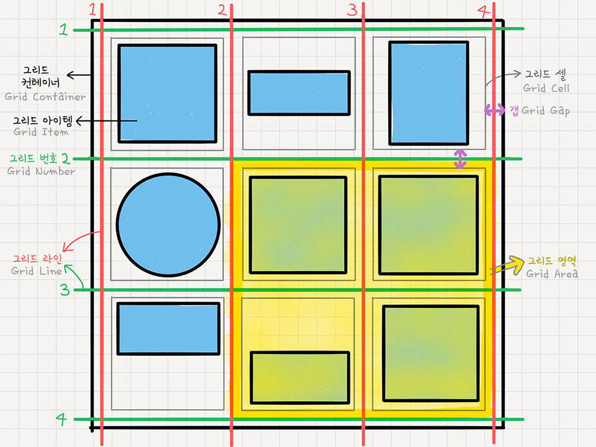

# 그리드(Grid)

CSS `Grid`(그리드)는 __2차원__(행과 열)의 레이아웃 시스템을 제공한다. 
Flexible Box가 비교적 단순한 1차원 레이아웃을 위한 것이라면, 좀 더 복잡한 레이아웃을 위해 CSS Grid를 사용할 수 있다.

CSS Grid는 예전부터 핵(Hack)으로 불린 다양한 레이아웃 대체 방식들을 해결하기 위해 만들어진 특별한 CSS 모듈이다.

 

 

## Grid Container & Grid Items

`CSS Grid`는 CSS Flex와 같이 Container(컨테이너)와 Item(아이템)이라는 두 가지 개념으로 구분되어 있다.
Container는 Items를 감싸는 부모 요소이며, Items는 컨테이너 안에서 배치되는 복수의 자식 요소들이다.

- Grid Container 관련 속성은 [이 문서](https://github.com/bomniekim/TIL/blob/master/css/grid-container.md)를 참조.
- Grid Items 관련 속성은 [이 문서](https://github.com/bomniekim/TIL/blob/master/css/grid-items.md)를 참조.

 
 

### Grid 트랙(Track)
Grid의 하나의 행(row) 또는 열(column)을 의미한다.

### Grid 셀(Cell)
아이템(Item)이 배치되는 최소 단위의 영역(Area)입니다.

### Grid 라인(Line)
셀을 구분하는 선(Line)은 일반적으로 거터(Gutter)라고 하는 트랙과 트랙 사이의 간격을 의미한다.

### Grid 영역(Area)
영역(Area)은 아이템이 배치되는, 하나 이상의 셀(Cell)로 이루어진 영역이다.

### Grid 갭(Gap)
Grid 셀 사이의 간격이다.

## Grid Functions
## Grid Units

