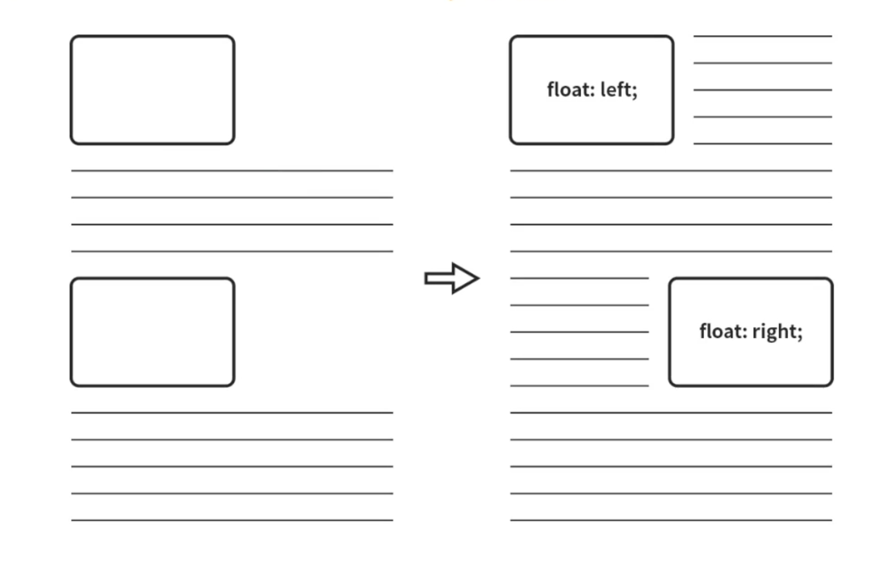
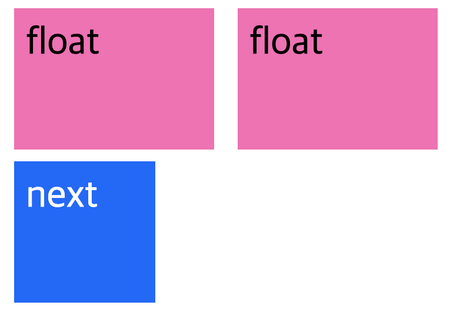

# Floats

모던 웹 페이지는 style과 layout을 담당하는 CSS를 사용하여 화면에 요소를 원하는 위치에 배열하는 layout을 구성하는 것이 바람직하다.

`float` 은 텍스트 내부에 이미지를 포함하고, 텍스트의 흐름을 자연스럽게 이어가게 구현할 수 있도록 도입되었다. <br> 레이아웃을 구성할 때 블록 레벨 요소는 수직으로 정렬된다. float 은 이러한 블록 레벨 요소를 왼쪽이나 오른쪽으로 띄운 후 가로(수평) 정렬하기 위해 사용되는 중요한 기법이다.

> float 이란 기본 레이아웃 흐름에서 벗어나 요소의 모서리가 페이지의 왼쪽이나 오른쪽에 이동하는 것이다.

<Br>



<br>
<br>

#### float 은 다음의 3 가지 속성을 가진다.

- `none` : 요소 띄움 없음 (default)

- `left` : 요소를 왼쪽으로 띄움
- `right` : 요소를 오른쪽으로 띄움


<Br>

#### [사용법]
```css
  img {
      float: left;
  }
```
<br>
<br>

## float 해제 하기

`float` 속성이 적용된 후 그 요소의 주위로 다른 요소들 역시 흐르게 되는데 이를 방지하기 위해서는 속성을 해제해야 한다.

<Br>

### 1) 형제 요소에 `clear`: (left, right, both) 지정 

`float` 속성이 추가된 요소의 다음 형제 요소에 clear 속성을 추가하여 해제한다.


```html
<div class="float-left">float</div>
<div class="float-left">float</div>
<div class="next">next</div>
```
```css

.float-left {
  float: left;
}

.next {
  clear: left;
```



<br>

### 2) 부모 요소에 `overflow`: (hidden, auto) 지정 

float 속성이 추가된 요소의 부모 요소에 overflow 속성을 추가한다.

```html
<div class="parent">
  <div class="child">float</div>
  <div class="child">float</div>
</div>
<div class="next">next</div>
```
```css
.parent{
  overflow: hidden; /* or auto */
}
.child {
  float: left;
}
```

> 1) 의 그림과 같은 모습으로 배치됨.


### 3) __부모 요소에 `clearfix` 클래스 추가 (추천!)__


