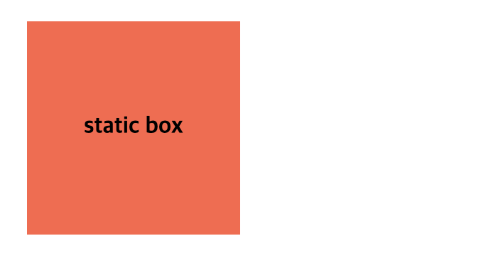

# Position

`position` 은 요소의 위치 지정 방법(배치)의 유형(기준)을 지정하는 속성이다. <br> `box offset` 속성과 함께 사용하여 위치를 지정한다.

<br>

## Box Offset Properties

`box offset` 이란 요소의 position 을 기준으로 한 상대적 위치와 그에 따라 정해지는 박스의 위치를 나타낸다. box offset 의 값은 `position` 을 기준으로 하는 다음과 같다.

- `top` 

- `bottom` 

- `right`

- `left`

모든 값은 음수 값을 허용하며 __위치 상의 상위 요소__ 를 기준으로 한다. 
> 위치 상의 상위 요소를 기준으로 한다는 것은 DOM의 구조적인 부모와 상관없이  `postion: xxx;` 가 부여된 요소가 기준이 된다는 것이다.

top / bottom 은 위치 상의 상위 요소의 세로 너비의 비율로 지정하고, left / right 는 위치 상의 상위 요소의 가로 너비의 비율로 지정한다.


<br>
<br>


## 1) `static` (기본 위치)

`static` 은 `position` 의 default 값으로 `position` 를 지정하지 않았을 때와 같다.

기본적인 요소의 배치 순서에 따라 위에서 아래로, 왼쪽에서 오른쪽으로 순서에 따라 배치되며 부모 요소 내에 자식 요소로써 존재할 때는 부모 요소의 위치를 기준으로 배치된다.

기본적으로 이 값을 지정할 일은 없지만 이미 설정된 position을 무력화하기 위해 사용될 수 있다.

`top`, `bottom`, `left`, `right`, `z-index` 속성은 무시된다.

```html
<div class="parent">
  <div class="static">static box</div>
</div>
```
```css
.parent {
    width: 150px;
    height: 150px;
    background: lightgray;
}
.static {
    position: static;
    background: tomato;
    line-height: 150px;
}
```


> lightgray 배경을 가진 부모 요소는 `static box` 와 정확히 일치하는 크기를 가지기 때문에 `static box` 뒤에 가려져 있음. 

<br>
<br>

## 2) `relative` (상대 위치)

요소를 일반적인 흐름에 따라 배치하고,
__자기 자신__ 을 기준으로 `box offset` 을 사용하여 위치를 이동시킨다.

> static을 선언한 요소와 relative를 선언한 요소의 차이점은 좌표 프로퍼티의 동작 여부뿐이며 그외는 동일하게 동작한다.

```html
<div class="parent">
  <div class="box relative">relative box</div>
  <div class="box">child box</div>
</div>
```
```css
.box {
     background: tomato;
     width: 150px;
     line-height: 150px;
     border: 1px solid;
}
.relative {
    position: relative;
    top: 50px;
    left: 40px;
}
```


> `position: relative;`는 실제로는 자기 자신의 원래 위치에 있는 것이고 `box offset` 을 이용하여 옮긴 위치는 (잔상이다..ㅋ.ㅋㅋㅋㅋㅋ...) <br>형제 요소인 `child box` 의 위치가 블록 서식 맥락에 맞게 차례로 위치해 있는 것을 보면 알 수 있다.<br><br> 즉, 특정 위치로 이동을 했으나 자기 자신의 위치에 그대로 남아 있어 형제 요소에 영향을 주고, 받는 상태이므로 사용에 주의해야 한다.

<br>
<br>

## 3) `absolute` (절대 위치)

부모 요소 (__위치 상의 상위 요소__ / static 제외)를 기준으로 `box offset` 값만큼 이동한다. 즉, `relative`, `absolute`, `fixed` 프로퍼티가 선언되어 있는 부모 또는 조상 요소를 기준으로 위치가 결정된다.

따라서 default 값인 `static` 이외에 position의 값이 설정되지 않은 경우라면 문서의 최상위 부모인 `<html>`까지 거슬러 올라간다. `<html>`에도 position 이 설정되지 않았다면, __뷰포트(화면 전체, window 객체)__ 를 기준으로 offset 값을 설정하여 요소를 위치시킨다.

```html
<div class="box">
  <div class="parent">
     <div class="child">absolute box</div>
  </div>
</div>
```
```css
.parent { 
  width: 300px;
  height: 250px;
  background: #0066ff;
  position: relative;
}

.child {
    background: tomato;
    position: absolute;
    top: 50px;
    left: 40px;
}
```


> absolute box를 기준으로 position 값이 설정된 가장 가까운 상위요소인 parent 를 기준으로 설정된 offset 값에 맞게 위치가  

<br>

---  

이때 다른 요소가 먼저 위치를 점유하고 있어도 뒤로 밀리지 않고 덮어쓰게 된다. (이런 특성을 부유 또는 부유 객체라 한다)


