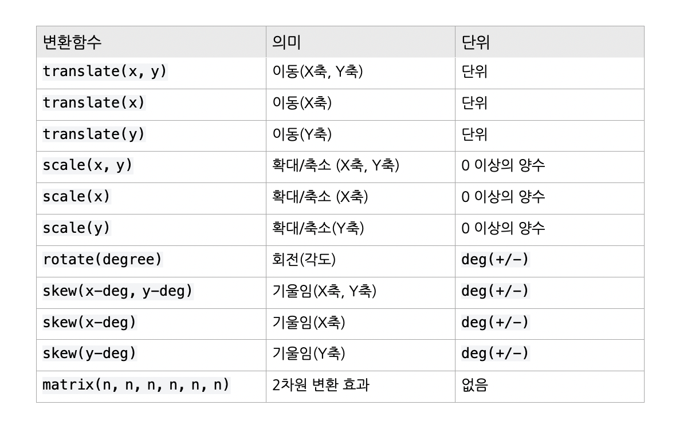
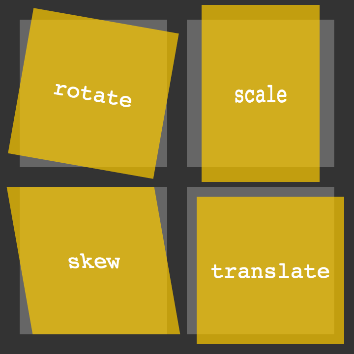
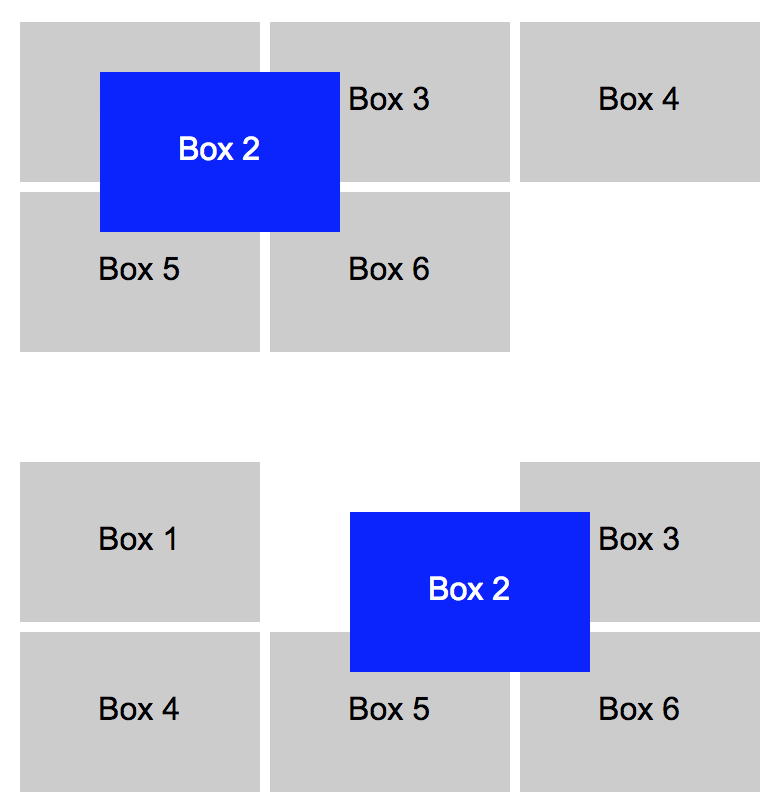
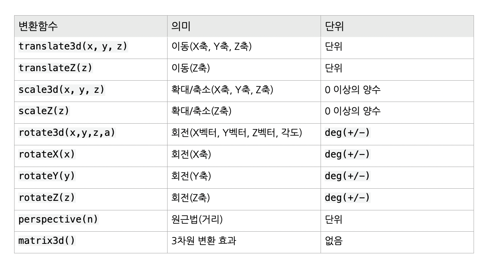
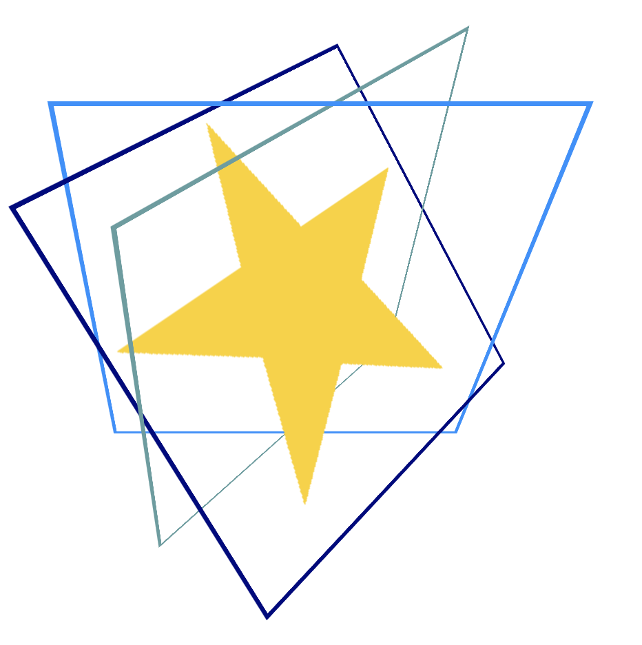
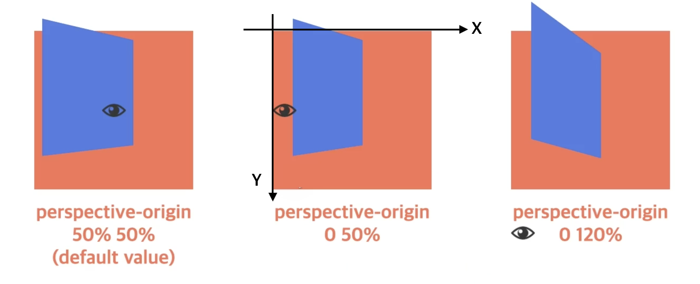

# Transform(변형)

`transform`은 좌표공간을 변형함으로써 일반적인 문서 흐름을 방해하지 않고 콘텐츠의 형태와 위치를 바꾼다.

요소에 이동(`translate`), 회전(`rotate`), 확대축소(`scale`), 비틀기(`skew`) 효과를 부여하기 위한 함수를 지정한다.

단 애니메이션 효과를 제공하지는 않기 때문에 정의된 프로퍼티가 바로 적용되어 화면에 표시된다.<br> 따라서 애니메이션 효과를 부여할 필요가 있다면 `transition`이나 `animation`과 함께 사용해야 한다.

<Br>

## 2D Transfrom

2D transform 은 속성 값으로 변환함수(transform function)를 사용한다. 변환함수는 다음과 같다.



<br>

### 1) `translate`(이동)

요소를 X축 또는 Y축의 이동 값에 따라 수평/수직으로 재배치한다.

<br>

### 2) `scale`(확대/축소)

요소의 크기를 X축으로 x배, Y축으로 y배 확대 또는 축소 시킨다.

<br>

### 3) `rotate`(회전)

요소를 지정한 각도만큼 회전시킨다.

<br>

### 4) `skew`(비틀기/기울임)

요소를 X축으로 x 각도만큼, Y축으로 y 각도만큼 기울인다.

<br>

> 사용예시



<br>
<br>

## position vs. translate()

`position` 은 말 그대로, 요소를 특정 지점에 배치하고 끝나는 개념이지만<br>`translate` 은 좌표 공간을 변형하여 다른 요소에 영향을 미치지 않고 위치를 변경할 수 있다.

요소를 특정 위치에 위치시키기 위한 것이 `position` 의 성격인 반면, 움직임이 필요한 모션의 경우는 `translate` 을 지정해야 한다.

즉, `translate` 이 애니메이션에 최적화된 방법!



> 위의 경우는 transform-translate, 아래는 position - top/left 활용 

<br>
<br>

## 3D Transform

3D transform 은 속성 값으로 변환함수(transform function)를 사용한다. 변환함수는 다음과 같다.



> `transform` 단축 속성에서 여러 변형 함수를 함께 `perspective()` 를 사용하는 경우 __가장 먼저__ 작성해야 적용된다.

<br>
<br>

## `transform` 관련 속성

### 1) `transform-origin`

요소 변환의 기준점을 설정한다.

```css
  transform-origin: x y z;

  /* default : 요소의 정중앙 */
  transform-origin: 50% 50% 0;
```

|값|의미|default|
|---|---|---|
|X축|`left`, `right`, `center`, `%`, 단위|50%|
|Y축|`top`, `bottom`, `center`, `%`, 단위|50%|
|Z축||0|

<br>

> 다양한 사용예시는 [여기](https://developer.mozilla.org/en-US/docs/Web/CSS/transform-origin)를 참조.

<Br>


### 2) `transform-style`

3D 변환 요소의 하위 요소도 3D 변환을 사용할 지 설정한다. 즉, 하위 요소에 3D 변환을 상속하기 위해서는 상위 요소에 `transform-style`의 값을 설정해야 한다.  

|값|의미|default|
|---|---|---|
|`flat`|하위 요소에 3D 변환을 사용하지 않음|✔︎|
|`preserve-3d`|하위 요소에 3D 변환을 사용함||

<br>

> 사용예시는 [여기](https://developer.mozilla.org/en-US/docs/Web/CSS/transform-style)를 참조.

<br>

### 3) `perspective`

__하위 요소__ 를 관찰하는 원근 거리를 설정한다.  따라서 3D 변형을 관찰할 요소들의 상위 요소에 이 속성을 지정해야 합니다.

|값|의미|default|
|---|---|---|
|단위|`px`, `em`, `cm` 등 단위로 지정||

<br>

```css
.perspective{
  width: 200px;
  /* 원근 거리를 관찰하는 지점을 관찰할 요소의 가운데로 지정하기 위해 요소의 너비와 일치시킨다., 기본값은 뷰포트 너비이고 이는 뷰포트의 중앙을 의미한다. */
  perspective: 500px;
}

.grand-parent{
  width: 300px;
  border: 3px solid dodgerblue;
  transform: rotateX(-45deg);
  transform-style: preserve-3d; 
}

.parent{
  width: 300px;
  border: 3px solid tomato;
  transform: rotateY(45deg);
  transform-style: preserve-3d;
}
img{
  width: 300px;
  border: 3px solid yellowgreen;
  transform: rotateX(45deg);
}
```




<br>

#### `transform: perspective()`와의 차이점?

`perspective` 속성은 관찰 대상의 __상위 요소에 적용__ 하여 하위 요소들을 관찰하는 원근 거리를 설정하며, 그 기준점은 `perspective-origin` 에 지정한다.

반면, `transform: perspective()` 변환 함수는 __관찰 대상에 직접 적용__ 하여 그 대상을 관찰하는 원근 거리를 설정한다. 기준점은 `transform-origin` 속성에 지정한다.

<br>


### 4) `perspective-origin`

원근 거리의 기준점을 __관찰할 요소들의 상위 요소__(`perspective` 속성이 지정되어 있는 요소)에 설정한다. 

|값|의미|default|
|---|---|---|
|X축|`left`, `right`, `center`, `%`, 단위| `50%`|
|Y축|`left`, `right`, `center`, `%`, 단위| `50%`|

> default 는 `perspective` 속성을 설정한 요소의 정중앙



> 눈동자의 위치가 `perspective-origin` 으로 설정한 값이다.

<br>

### 5) `backface-visibility`

3D 변환으로 회전된 요소의 뒷면 숨김을 설정한다.

|값|의미|default|
|---|---|---|
|visible|뒷면 숨기지 않음|✔︎|
|hidden|뒷면 숨김|

<br>

> 사용예시는 [여기](https://developer.mozilla.org/ko/docs/Web/CSS/backface-visibility)를 참조.


<Br>
<Br>

## `matrix()`

위의 2D/3D 변형 함수(이동, 확대/축소, 회전, 기울임)의 단축 속성이다.
> 위의 일반 함수들을 사용하여 `transform` 을 작성하더라도, 브라우저는 matrix 함수(2D 변형 함수는 `matrix` 로, 3D 변형 함수는 `matrix3d`)로 변환하여 변형을 계산한다. 따라서 일반적인 경우는 일반 함수들을 사용하면 된다.


<br>

## 단축 속성

```css
  transform: func1, func2, func3 ...;
  transfrom: 원근법 이동 크기 회전 기울임;

.app{
    transform: perspective(500px) rotate(20deg) translate(10px, 0);
}
```

---
### References
- [transform via MDN](https://developer.mozilla.org/ko/docs/Web/CSS/transform)
- [CSS transform via poiemaweb](https://poiemaweb.com/css3-transform)
- [translate() vs positioning 비교](https://mygumi.tistory.com/238)