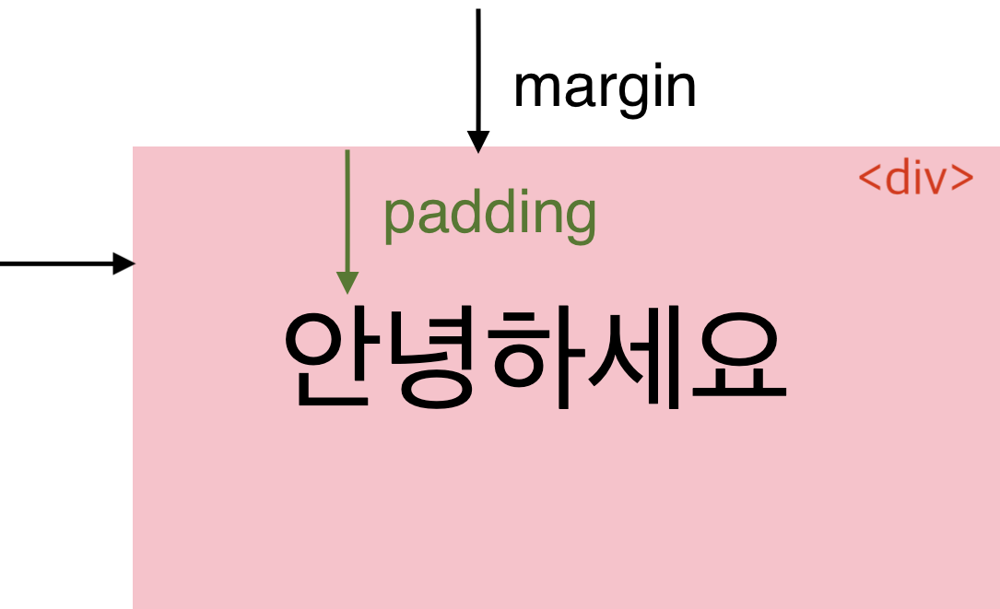
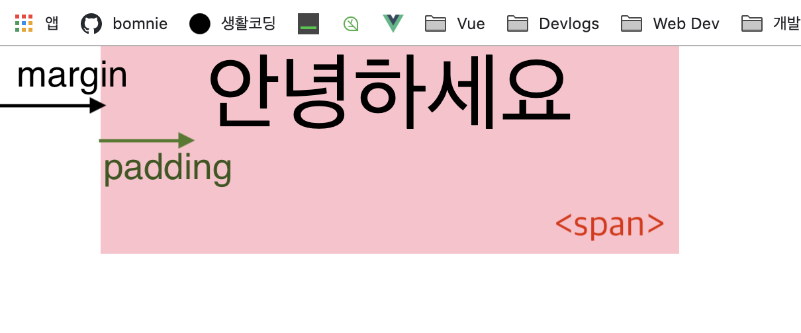

# 블록(block) 요소 vs. 인라인(inline) 요소

<br>
<br>

## block element

```css
display: block;
```

**블록 요소** 는 기본적으로 부모 요소의 전체 공간을 차지하여 사용 가능한 최대 가로 너비를 사용하여 "블록"을 만든다.

> A block-level element always starts on a new line and takes up the full width available (stretches out to the left and right as far as it can).

<br> 
<br>
특징

- `width: 100px, height: 0` 으로 시작하여 수직으로 쌓인다.

- margin, padding 의 상하좌우 모든 값을 지정하여 사용할 수 있다.

> [margin, padding으로 각각 20px 설정한 div 요소] 
> 상/하/좌/우 모두 여백이 설정된 모습

- layout 작업에 최적화된 태그이다.
- `<div>`,`<article>`,`<section>`,`<h>`,`<p>` 등 <br>

> cf) **div** vs. **article** vs. **section**
> |태그|의미|
> |---|---|
> |`<div>`| 단순 영역 구분|
> |`<section>`| `<h>` 태그(제목)을 포함하는 영역 구분|
> |`<article>`| 독립적으로 의미를 구분하여 재사용/배포 가능한 영역 |
> <br>

_[MDN 블록 요소 전체 목록](https://developer.mozilla.org/ko/docs/Web/HTML/Block-level_elements#요소*목록)_
<br>
<br>
<br>

## inline element

```css
display: inline;
```

**인라인 요소** 는 콘텐츠의 흐름을 끊지 않고, 요소를 구성하는 태그에 할당된 공간만 차지한다.

> An inline element does not start on a new line and only takes up as much width as necessary.

<br>
<br>
특징

- `width: 0, height: 0` 으로 시작하여
  수평으로 쌓인다.
- __width / height 의 값을 지정해도 인식하지 않는다.__
- margin, padding 의 위/아래 값을 지정할 수 없다.

> [margin, padding으로 20px 설정한 span 요소]<br> <br>
> 오른쪽/왼쪽에는 여백이 적용되었으나 위/아래에는 적용되지 않음.

- text 작업에 최적화된 태그이다.

- `<span>`,``,`<a>`,`<strong>` 등
  <br>
  <br>
  <br>

### <u>주요 인라인 요소</u>

#### `<a>`

href 속성을 통해 다른 페이지, 같은 페이지 위치(# 으로 설정), 파일, 이메일 주소, 전화번호 등 다른 URL로 연결할 수 있는 하이퍼링크를 설정한다.
<br>

| 속성         | 의미                                                | 값                     | default | 특징                                       |
| ------------ | --------------------------------------------------- | ---------------------- | ------- | ------------------------------------------ |
| **download** | 리소스를 다운로드하는 용도로 사용되는 태그임을 명시 | boolean                |         |                                            |
| **href**     | 하이퍼링크가 가리키는 url                           | 절대/상대경로          |         | 브라우저가 지원하는 모든 URL 스킴 사용가능 | html5: 생략가능 |
| rel          | 현재 문서와 리소스와의 관계                         | license, prev, next 등 |         |                                            |
| **target**   | 링크 URL의 표시(브라우저 탭) 위치                   | \_self, \_blank 등     | \_self  |                                            |
| type         | 링크 url의 MIME 타입                                | text/html 등           |         |                                            |

<br>
<br>

#### `<b>`

The `<b>` tag specifies bold text without any extra importance.

특별한 의미를 가지지는 않으나 읽기 흐름에 도움을 주기 위한 용도로 사용한다. 그 외의 다른 특별한 중요도는 주어지지 않는다. 원래는 "굵은 글씨 요소"로 불렸으며, 대부분의 브라우저도 여전히 텍스트를 굵은 글씨체로 강조한다. 다른 태그가 적합하지 않은 경우 가장 마지막 수단으로 사용한다.
<br>
<br>

#### `<em>`

The `<em>` tag is used to define emphasized text.

단순한 의미 강조를 표시한다. 기본적으로 브라우저에 이탤릭체로 표시되며 중첩이 가능하여 더 큰 강세를 의미할 때 사용한다. 정보통신보조기기 등에서 구두 강조(verbal stress)로 발음된다.
<br>
<br>

#### `<strong>`

The `<strong>` tag is used to define text with strong importance.

의미의 중요성을 나타내기 위해 사용된다. 단순 의미 강조 용도의 `<em>` 태그 차이가 있다. 기본적으로 볼드체로 표시된다.

<br>
<br>

#### `<mark>`

The `<mark>` tag defines text that should be marked or highlighted.

현재 맥락에 관련이 깊거나 중요한 부분을 표시/하이라이트 한다. (형광펜으로 표시하는 것과 같은 의미) 사용자의 관심을 끌기 위해 사용된다.

<br>
<br>

#### `<i>`

The `<i>` tag is often used to indicate a technical term, a phrase from another language, a thought, a ship name, etc.

&lt;em&gt;, &lt;strong&gt;, &lt;mark&gt;, &lt;cite&gt;, &lt;dfn&gt; 등에서 표현할 수 있는 적합한 의미가 아닌 경우 사용한다. 아이콘(fontawesome 등의 웹 아이콘을 표시)이나 특수기호 같이 평범한 글자와 구분짓기 위해 사용된다. 기본적으로 이탤릭체로 표시된다.
<br> <br>

_[MDN 인라인 요소 전체 목록](https://developer.mozilla.org/ko/docs/Web/HTML/Inline_elements#요소*목록)_

<br> <br> <br>

---

### References

- [MDN 블록 레벨 요소](https://developer.mozilla.org/ko/docs/Web/HTML/Block-level_elements)
- [MDN 인라인 요소](https://developer.mozilla.org/ko/docs/Web/HTML/Inline_elements)
- [MDN display](https://developer.mozilla.org/ko/docs/Web/CSS/display)
- [W3C schools HTML Element Reference](https://www.w3schools.com/tags/)
- [한눈에 보는 HTML 요소(Elements & Attributes) 총정리 by heropy](https://heropy.blog/2019/05/26/html-elements/)
