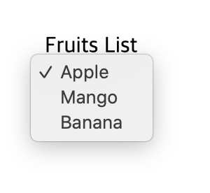

# Form (양식)

<br>

## `<form>`

웹 서버에 데이터를 제출하기 위해 사용하는 양식 범위를 지정하는 태그이다.
`<form>`이 다른 `<form>`을 자식 요소로 포함할 수 없다.

<br>

#### 속성

- `action`: 전송한 데이터를 처리할 웹페이지의 URL
- `autocomplete`: 사용자가 이전에 입력한 값으로 자동 완성 기능을 사용할 것인지 여부
  - on (default)
  - off
- `method`: `<form>`을 제출할 때 사용할 HTTP 메서드
  - `GET` (default) : form data appended to the action URL with a ? separator.
  - `POST` : form data sent as the request body.
  - dialog: `<form>`이 `<dialog>` 안에 위치한 경우, 제출과 함께 대화 상자를 닫음.
- `id`: `<form>`의 이름 (HTML 4 이전에는 name 사용)
- `novalidate`: 서버로 전송시 양식 데이터의 유효성을 검사하지 않도록 지정
- `target`: 서버로 전송 후 응답받을 방식을 지정

  - \_self (default) : 현재 브라우저에 표시
  - \_blank : 새 브라우저에 표시

  <br>
  <br>
  <br>

## `<input>`

사용자의 데이터를 입력 받을 수 있는 interactive controls를 생성한다.

<br>

#### 속성

- `type`: 입력받을 데이터의 종류

  > **[type에 입력할 수 있는 값의 목록](https://developer.mozilla.org/en-US/docs/Web/HTML/Element/input#<input>_types) 참고하세요. 매우 중요!**

  | 값       | 데이터 종류               | 특징                                        |
  | -------- | ------------------------- | ------------------------------------------- |
  | button   | 일반 버튼                 | `<button>`처럼 사용                         |
  | checkbox | 체크박스                  |                                             |
  | image    | 이미지 제출 버튼          | `submit`과 같은 기능을 하면서 이미지를 제공 |
  | radio    | 라디오 버튼               | 같은 `name` 그룹 내에서 하나만 선택 가능    |
  | reset    | 초기화                    | 해당 `<form>` 범위 내 모든 초기화           |
  | hidden   | 보이지 않지만 전송할 양식 | `value` 속성으로 값을 지정                  |

<br>

- `autofocus` : 페이지가 로드될 때 자동으로 포커스

  > 문서 내 하나의 `<input>` 에만 지정해야 함

- `form`: `<form>`의 자식 요소가 아닌 바깥에 `<input>`을 작성한 경우 `<form>` 요소의 `id` 값을 이용해 연결
- `list`: 참조할 `<datalist>`의 `id` 값을 이용해 연결
- `multiple`: 둘 이상의 값을 입력 할 수 있는지 여부
  > `type` 값이 `email`, `file` 인 경우에만 지정 가능 <br> > `email`인 경우 `,`로 구분
- `step`: 유효한 숫자의 증감 간격 지정
- `max` / `min`: 입력 가능한 숫자 최대값/최소값 지정
- `maxlength`: 입력 값의 최대 길이(length) 지정
- `value`: `<input>`의 초기 값

<br>
<br>
<br>

## `<label>`

사용자 인터페이스 항목의 설명을 나타낸다.<br>
라벨 가능 요소(labelable)의 제목(Caption)이다.

> 레벨 가능 요소: `<button>`, `<input>`, `<progress>`, `<select>`, `<textarea>`

- `for` 속성으로 라벨 가능 요소의 `id`와 연결하여 참조하거나 콘텐츠로 포함한다.

<br>

사용예시

- `<label>`의 콘텐츠 텍스트를 클릭하면, `for` 속성으로 참조된 체크박스가 선택된다.

```html
<input type="checkbox" id="user-agreement" />
<label for="user-agreement">Do you agree?</label>
```

- `<label>` 에 포함된 어느 것을 눌러도 체크박스가 선택된다. **(권장)**

```html
<label><input type="checkbox" />Do you agree?</label>
```

- `<label>` 내에 `<a>` 또는 `<button>`와 같은 인터랙티브 요소를 배치하지 않는다. 사용자가 `label`과 관련된 양식을 입력하기 어려움.
- `<label>` 내에 제목 요소(`<h1>`-`<h6>`)를 배치하면 많은 종류의 보조 기술을 방해하므로 제목이 필요한 경우 `<fieldset>` 내에 배치 된 `<legend>` 요소를 사용함.

  <br>
  <br>

## `<button>`

선택 가능한 버튼을 지정한다. form 과 상관없이 간단한 표준 버튼 기능이 필요한 곳이라면 문서 내 어디에나 배치할 수 있다.

#### 속성

- `type`
  - submit : form 제출
  - reset : 초기화
  - button : 일반 버튼 ( form 제출용 버튼이 아니라면 type 값을 button으로 지정)
- `form`: `<form>` 요소 외부에 작성할 때 연결하려는 `<form>` `id` 값을 지정

> `<button>` 요소는 `<input>` 요소보다 스타일을 적용하기 훨씬 수월하다. `<input>`은 value 특성에 텍스트 값밖에 지정할 수 없지만,<br>` <button>`은 내부 HTML 콘텐츠(`<em>`, `<strong>`, 심지어 ``도)에 더해 ::after와 ::before 의 CSS 요소를 사용하는 복잡한 렌더링도 가능.

<br>
<br>
<br>

## `<fieldset>` / `<legend>`

같은 목적의 `form`을 그룹화(`<fieldset>`)하여 제목(`<legend>`)을 지정한다.

사용예시

```html
<form>
  <fieldset>
    <legend>Coffee Size</legend>
    <label>
      <input type="radio" name="size" value="tall" />
      Tall
    </label>
    <label>
      <input type="radio" name="size" value="grande" />
      Grande
    </label>
    <label>
      <input type="radio" name="size" value="venti" />
      Venti
    </label>
  </fieldset>
</form>
```


<br>
<br>
<br>

## `<select>`

옵션을 선택하는 메뉴를 나타낸다.

사용예시

```html
<label for="fruits">Fruits</label>
<select name="fruits" id="fruits">
  <option value="apple">Apple</option>
  <option value="mango">Mango</option>
  <option value="banana">Banana</option>
</select>
```

## 

---

### References

- [MDN &lt;form&gt;](https://developer.mozilla.org/ko/docs/Web/HTML/Element/form)
- [MDN &lt;input&gt;: 입력요소](https://developer.mozilla.org/ko/docs/Web/HTML/Element/input)
- [MDN &lt;label&gt;](https://developer.mozilla.org/ko/docs/Web/HTML/Element/Label)
- [MDN &lt;button&gt;: 버튼요소](https://developer.mozilla.org/ko/docs/Web/HTML/Element/Button)
