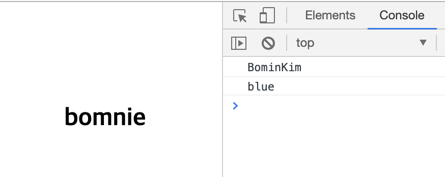

# 전역 속성(global attributes)

전역 속성(global attributes)이란 모든 HTML 요소에서 공통적으로 사용 가능한 속성이다.

<br>
<br>

## `class`

요소에 별칭을 지정한다. 한 요소에 여러 `class`를 지정할 수 있으며 공백으로 구분한다.

```html
<!-- a 와 b 라는 2 개의 클래스를 지정 -->
<div class="a b">division</div>
```

<br>

## `id`

문서에서 고유한 식별자(idenifier)를 지정한다.

<br>

## `style`

요소에 지정할 CSS를 선언한다. (inline style)

```html
<span style="color: blue;">text</span>
```

<br>

## `title`

요소의 정보(설명)을 지정합니다.

```html
<div title="title">show title</div>
```

<br>

## `lang`

요소에서 사용하는 주요 언어를 지정한다.

```html
<p lang="en">This paragraph is English</p>
<p lang="ko">이 단락은 한글입니다.</p>
<p lang="fr">Ce paragraphe est défini en français.</p>
```

<br>

## `data-*`

사용자 정의 데이터 속성을 지정한다.

> HTML에 JavaScript에서 이용할 수 있는 데이터(정보)를 저장하는 용도로 사용한다.

```html
<!-- data-custom-data-attributes -->
<h2 id="me" data-my-name="BominKim" data-my-color="blue">bomnie</h2>
```

```javascript
// dataset.customDataAttributes
const me = document.getElementById("me");
console.log($me.dataset.myName); // "BominKim"
console.log($me.dataset.myColor); // "blue"
```


